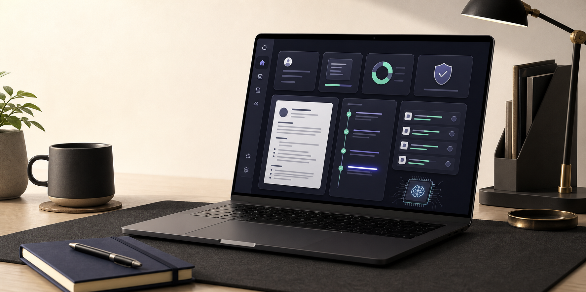
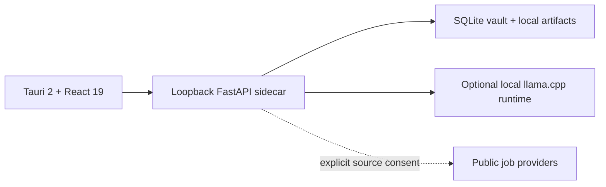

# CareerOS Local



> Turn verified experience into resumes, job matches, and an application pipeline—without sending personal career data to cloud AI.

CareerOS Local is a private desktop workspace for the full career journey. It keeps a structured Career Vault, evidence-backed facts, goals, resume versions, applications, coaching history, and AI audit metadata on the user's device.

The project is being prepared for [OpenAI Build Week](docs/devpost.md). The repository is the source of truth; public release and Devpost submission links are intentionally not claimed until they exist.

## See it in action

| Daily workspace | Resume Studio |
| --- | --- |
|  |  |


The screenshots use a fictional local profile. No personal account or production data is included.

## What makes it different

- **Career Vault:** structured identity, experience, education, skills, evidence provenance, preferences, and career goals.
- **Verified resumes:** ATS-focused or photo layouts generated only from confirmed profile facts.
- **Editable canvas:** direct content editing, section ordering, visibility, spacing, pagination, undo, and redo.
- **Immutable outputs:** named resume versions with quality-checked PDF and DOCX artifacts.
- **Opportunity workflow:** local job matching connected to an append-only application timeline.
- **Grounded local AI:** explicit context selection, strict output schemas, evidence retrieval, one bounded repair attempt, and content-free audit metadata.
- **Data ownership:** versioned portable backups, transactional restore, and explicit secure vault erasure.

Core profile, resume, application, backup, and editing workflows work without an AI model.

## Local-first boundary

CareerOS Local does not include a cloud AI provider or a hidden cloud fallback. The optional model runs through a managed llama.cpp-compatible runtime on loopback, after the user reviews its license and grants download consent. Model artifacts are checksum-verified before activation.

Job-source connectors are a separate, explicit network boundary: when enabled, they retrieve public listings. They do not turn the Career Vault into cloud-model context. There is no telemetry or remote analytics in the application.



See [architecture](docs/architecture.md), [privacy](docs/privacy.md), and [security policy](SECURITY.md) for the detailed trust model.

## Judge quickstart

The fastest reproducible path is browser mode on Windows PowerShell. It exercises the same React UI, FastAPI API, SQLite schema, and local-only data paths as the desktop app.

Requirements:

- Python 3.12
- Node.js 22 and npm
- Git

Install the locked dependencies and migrate a local database:

```powershell
python -m venv .venv
.venv\Scripts\python.exe -m pip install --require-hashes -r requirements-dev.lock
npm ci --prefix frontend
.venv\Scripts\alembic.exe upgrade head
```

Start the backend and frontend in separate terminals:

```powershell
.venv\Scripts\python.exe -m uvicorn backend.main:app --host 127.0.0.1 --port 8000
```

```powershell
npm --prefix frontend run dev -- --host 127.0.0.1
```

Open `http://127.0.0.1:5173`, create a local account, and follow the in-app workflow. To populate a fresh local database with a fictional Ada profile suitable for the same product tour, run the optional loopback-only demo seeder after the backend starts:

```powershell
.venv\Scripts\python.exe scripts/seed_demo.py --password "CareerOS-Demo-2026!"
```

Then sign in as `ada_demo` with the password supplied above. The seeder refuses non-loopback destinations, follows no redirects, and is idempotent for its own demo records. Use it only with a disposable development database.

## Native desktop development

Native mode additionally requires Rust stable and the [Tauri 2 platform prerequisites](https://v2.tauri.app/start/prerequisites/):

```powershell
npm --prefix frontend run tauri:dev
```

The command builds the Python sidecar for the active architecture and launches the Tauri shell. The model is not bundled; AI-assisted features are optional and installed from the home screen. Packaging, checksums, and signing expectations are documented in [releasing](docs/releasing.md).

## Verify

The local release gates are intentionally offline by default:

```powershell
.venv\Scripts\python.exe -m ruff check backend tests/backend alembic/versions scripts/seed_demo.py
.venv\Scripts\python.exe -m mypy backend scripts/seed_demo.py --ignore-missing-imports --no-error-summary
.venv\Scripts\python.exe -m pytest tests/backend -q
npm --prefix frontend test
npm --prefix frontend run lint
npm --prefix frontend run build
cargo fmt --manifest-path frontend/src-tauri/Cargo.toml --check
cargo clippy --manifest-path frontend/src-tauri/Cargo.toml --all-targets -- -D warnings
cargo test --manifest-path frontend/src-tauri/Cargo.toml
```

For database changes, also run `alembic upgrade head`, `alembic downgrade -1`, and `alembic upgrade head` against a disposable SQLite database.

## Build Week provenance

CareerOS Local is a substantial Build Week extension of the pre-existing Job Hunter AI codebase. The event work added the desktop product identity, Career Vault, grounded resume studio, application workflow, local model management, secure portability and erasure, Tauri sidecar lifecycle, and expanded Python/React/Rust validation.

OpenAI Codex was used as an implementation partner across architecture tracing, implementation, migrations, testing, privacy review, and packaging checks. Product scope, privacy boundaries, evidence requirements, release claims, and submission decisions remained human-owned. The exact GPT-5.6 session evidence is a submission-time gate tracked in the [Devpost editing brief](docs/devpost.md); it must be obtained through `/feedback` before the project is submitted.

## Project map

- [Development guide](docs/development.md)
- [Architecture](docs/architecture.md)
- [Privacy model](docs/privacy.md)
- [Release process](docs/releasing.md)
- [Devpost submission kit](docs/devpost.md)
- [Active product specification](specs/001-desktop-career-agent/spec.md)
- [Release evidence](specs/001-desktop-career-agent/release-evidence.md)

## License

CareerOS Local is released under the [MIT License](LICENSE). Third-party runtimes and models retain their own licenses; the application displays the selected model license before download.
