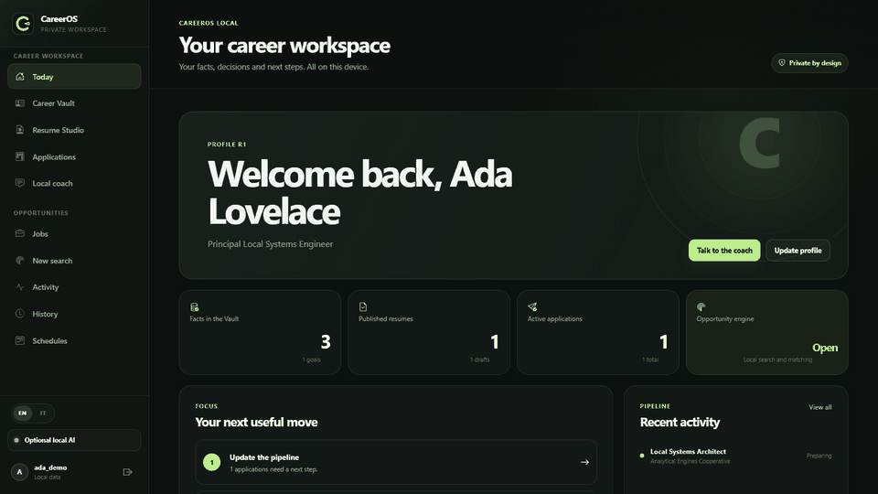

<p align="center">
  
</p>

# CareerOS Local

[](https://github.com/ejupi-djenis30/careeros-local/actions/workflows/ci.yml)
[](https://github.com/ejupi-djenis30/careeros-local/releases/latest)
[](LICENSE)


> Your career history should become more useful over time, not more exposed.

CareerOS Local is an open-source, local-first career utility for turning verified experience into polished
resumes, relevant opportunities, and an application pipeline you can actually operate. Before
anything is sent, a deterministic readiness pack shows exactly what is present, what is missing
and where to fix it. The Career Vault preserves source facts and revision history. Record keeping,
manual applications, document editing, exports, backups, and readiness checks remain available
without a model; opportunity matching and coaching require a ready, approved local runtime.

[](https://ejupi-djenis30.github.io/careeros-local/#demo)

**[Watch the 40-second product tour](https://ejupi-djenis30.github.io/careeros-local/#demo)** ·
[Direct WebM download](https://ejupi-djenis30.github.io/careeros-local/assets/careeros-demo.webm) ·
[Open the portfolio site](https://ejupi-djenis30.github.io/careeros-local/) ·
[View the Devpost project](https://devpost.com/software/careeros-local) ·
[View releases](https://github.com/ejupi-djenis30/careeros-local/releases) ·
[Daily-driver guide](docs/daily-driver.md) · [Architecture](docs/architecture.md) ·
[Privacy model](docs/privacy.md)

## Why CareerOS

- **Trust the record:** career facts retain provenance, verification status, and revision
  history instead of dissolving into untraceable generated claims.
- **Own the useful record:** profile, resume, manual application, backup, export, and editing
  workflows stay available while a model is being installed or repaired.
- **Keep the private parts private:** the API, database, artifacts, and analysis runtime
  remain on the device, with no telemetry and no cloud-model fallback.
- **Move from intent to follow-through:** immutable PDF/DOCX resume versions, local job
  snapshots, a private daily action agenda, verifiable application dossiers and a nine-check
  preflight keep the workflow coherent.

## Product tour

| Daily workspace | Career Vault |
| --- | --- |
|  |  |

| Resume Studio | Application pipeline |
| --- | --- |
|  |  |

All captures are generated from a disposable database with the fictional Mira Vale profile.
The recorder rejects visible alerts, browser errors and failed API responses before publishing
the assets.

## Engineering highlights

- Tauri 2 owns the desktop shell and supervised FastAPI sidecar lifecycle.
- React 19 provides the keyboard-accessible workspace and editable resume canvas.
- SQLite, SQLAlchemy and Alembic provide transactional storage and migrations.
- Versioned archives restore atomically and exclude private cross-user or runtime state.
- Application readiness is calculated without a model from owned local records, exposes weighted
  evidence and actions, and exports reproducible JSON or Markdown reports.
- Search planning has a deterministic path based only on the role, strategy and preferences the
  user entered. It never converts CV text or unconfirmed model-normalized fields into provider
  queries. Listings found elsewhere can be imported into a private per-user namespace.
- Application tasks are append-only events with a narrow next-action projection and portable
  calendar reminders. Dossier ZIPs include versioned answers, ID-only requirement mappings, one
  deduplicated evidence catalog, verified resume files and a canonical SHA-256 manifest.
- The daily application agenda reads only owned scalar projections. It orders overdue, today,
  upcoming, undated and missing next actions without replaying private event payloads or requiring
  the model, and reports actions omitted by its seven-day horizon or compact row limit. Counts and
  rows share one SQL-statement snapshot; the renderer supplies the next browser-local midnight so
  today remains correct across daylight-saving transitions.
- Vault erasure sanitizes SQLite even when artifact cleanup needs a retry.
- Local AI calls use explicit context, strict schemas, bounded repair and content-free audit
  metadata through a managed llama.cpp-compatible runtime.
- CI verifies Python, React and Rust code, migrations, dependency licenses, SBOMs, containers
  and fixed high/critical vulnerabilities.

Current accepted dependency risks, their owners, controls, and expiry dates are recorded in the
[security policy](SECURITY.md#active-dependency-exceptions).

## Architecture


The local model receives only the context selected for a task. Job-source connectors are a
separate, explicit network boundary used to retrieve public listings; they never become an
inference fallback. See the [architecture](docs/architecture.md),
[privacy model](docs/privacy.md) and [security policy](SECURITY.md) for the complete trust model.

## Technology

| Layer | Stack |
| --- | --- |
| Desktop | Tauri 2, Rust |
| Interface | React 19, Vite, Bootstrap Icons |
| Local API | Python 3.12, FastAPI, Pydantic |
| Data | SQLite, SQLAlchemy, Alembic |
| Documents | ReportLab, python-docx, pypdf, Pillow |
| Local analysis | Managed llama.cpp-compatible runtime, schema-validated pipelines |
| Quality | pytest, Vitest, ESLint, Ruff, mypy, Clippy, Cargo test, Trivy, CycloneDX |

## Install the desktop app

Download the latest community build from [GitHub Releases](https://github.com/ejupi-djenis30/careeros-local/releases/latest).

| Platform | Choose this asset |
| --- | --- |
| Windows x64 / ARM64 | `windows-*-setup.exe` for the guided installer, or `windows-*.msi` for managed deployment |
| macOS Apple Silicon / Intel | `macos-arm64.dmg` or `macos-x64.dmg` |
| Linux x64 / ARM64 | `linux-*.AppImage` for a portable app, or `linux-*.deb` on Debian-based systems |

These are unsigned community builds. Before installing, compare the file with `SHA256SUMS` and
verify its GitHub attestation:

```shell
gh attestation verify <downloaded-file> --repo ejupi-djenis30/careeros-local
```

The app keeps its vault in the operating system's private application-data directory. Removing
the app does not silently erase that data. If you want a clean removal, export anything you need,
use the in-app vault erasure flow, and then uninstall the package.

## Run locally

Requirements: Python 3.12, Node.js 24 LTS, npm and Git. Native desktop development additionally
requires Rust stable and the [Tauri prerequisites](https://v2.tauri.app/start/prerequisites/).

```powershell
python -m venv .venv
.venv\Scripts\python.exe -m pip install --require-hashes -r requirements-dev.lock
npm ci --prefix frontend
.venv\Scripts\python.exe -m alembic upgrade head
```

Start the local API and interface in separate terminals:

```powershell
.venv\Scripts\python.exe -m uvicorn backend.main:app --host 127.0.0.1 --port 8000
```

```powershell
npm --prefix frontend run dev -- --host 127.0.0.1
```

Open `http://127.0.0.1:5173`. To create the same disposable fictional workspace used in the
tour, run this only against a development database:

```powershell
.venv\Scripts\python.exe scripts\seed_demo.py --password "MiraDemo2026!"
```

Then sign in as `mira_demo` with the supplied password. The seeder accepts loopback destinations
only, follows no redirects, does not overwrite unrelated profile data, publishes locally verified
PDF/DOCX files and confirms that the fictional application reaches 100/100 preflight completeness.

For the native shell:

```powershell
.venv\Scripts\python.exe -m pip install --require-hashes -r requirements-tooling.lock
npm --prefix frontend run tauri:dev
```

## Reproduce the portfolio media

The media pipeline starts an isolated database and services on free loopback ports, seeds
fictional data, records the real product and removes its temporary vault afterward.

```powershell
npm --prefix frontend run demo:install
npm --prefix frontend run demo:record
```

It outputs a 1280×720 WebM tour, a lightweight animated preview, a poster and four clean
screenshots under `docs/assets/`. Full details are in the [demo recording guide](docs/demo.md).

## Verify

```powershell
.venv\Scripts\python.exe -m ruff check backend tests/backend alembic/versions scripts
.venv\Scripts\python.exe -m mypy backend scripts --ignore-missing-imports --no-error-summary
.venv\Scripts\python.exe -m pytest tests/backend -q --cov=backend --cov-branch --cov-fail-under=80
npm --prefix frontend run test:coverage
npm --prefix frontend run lint
npm --prefix frontend run build
cargo fmt --manifest-path frontend/src-tauri/Cargo.toml --check
cargo clippy --manifest-path frontend/src-tauri/Cargo.toml --locked --all-targets -- -D warnings
cargo test --manifest-path frontend/src-tauri/Cargo.toml --locked
```

Database changes also require an `upgrade head → downgrade -1 → upgrade head` round trip against
a disposable SQLite database.

## Project background

CareerOS Local is a substantial desktop and privacy-focused extension of the earlier Job Hunter
AI codebase, developed during OpenAI Build Week. The work added the Career Vault, grounded resume
studio, application workflow, managed local model lifecycle, secure portability and erasure,
Tauri sidecar integration and expanded Python/React/Rust verification. The detailed, claim-aware
hackathon material remains in the [Devpost submission kit](docs/devpost.md).

Product direction and maintenance stay with the project maintainers. Additional work is credited
collectively to **CareerOS Local contributors**.

## Documentation

- [Development guide](docs/development.md)
- [Brand system](docs/brand.md)
- [Demo recording guide](docs/demo.md)
- [Architecture](docs/architecture.md)
- [Privacy model](docs/privacy.md)
- [Release process](docs/releasing.md)
- [Devpost submission kit](docs/devpost.md)
- [Product specification](specs/001-desktop-career-agent/spec.md)
- [v1.5.0 release preparation](specs/001-desktop-career-agent/release-evidence-v1.5.0.md)
- [v1.4.0 release preparation](specs/001-desktop-career-agent/release-evidence-v1.4.0.md)
- [v1.3.0 release preparation](specs/001-desktop-career-agent/release-evidence-v1.3.0.md)
- [v1.2.0 release preparation](specs/001-desktop-career-agent/release-evidence-v1.2.0.md)
- [v1.1.0 release preparation](specs/001-desktop-career-agent/release-evidence-v1.1.0.md)
- [v1.0.2 release evidence](specs/001-desktop-career-agent/release-evidence-v1.0.2.md)
- [Historical v1.0.0 Windows evidence](specs/001-desktop-career-agent/release-evidence.md)
- [Contributing guide](CONTRIBUTING.md)
- [Changelog](CHANGELOG.md)

## License

CareerOS Local is released under the [MIT License](LICENSE). Third-party runtimes and models
retain their own licenses; the application displays the selected model license before download.
