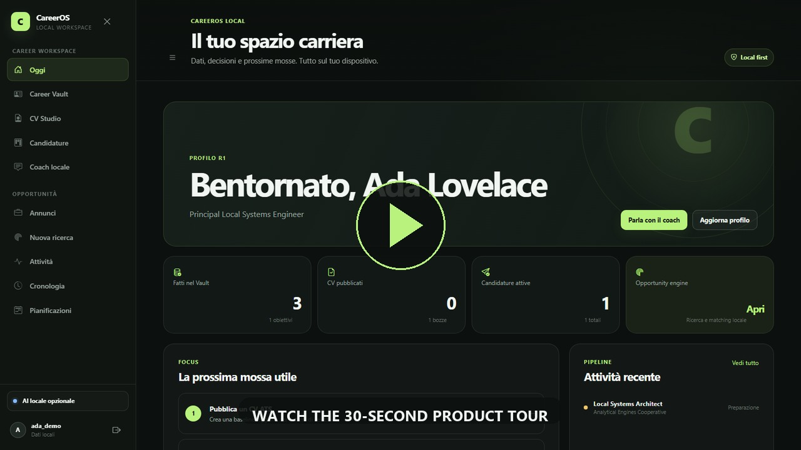
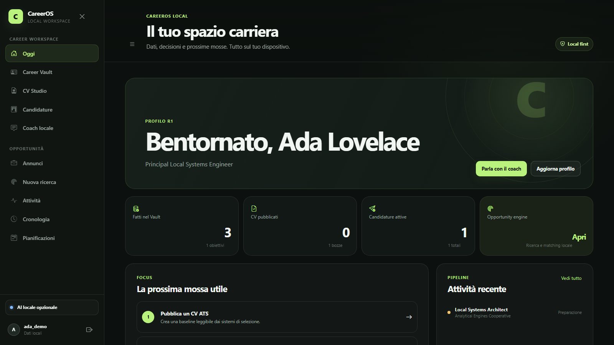
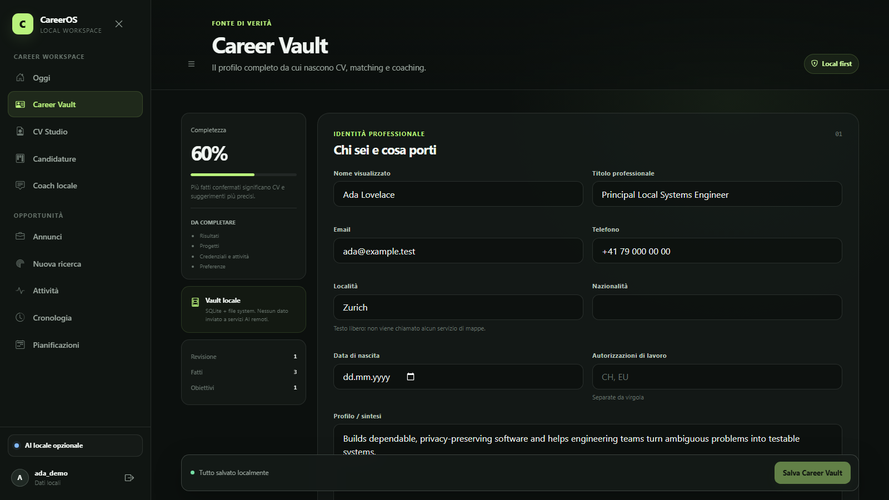
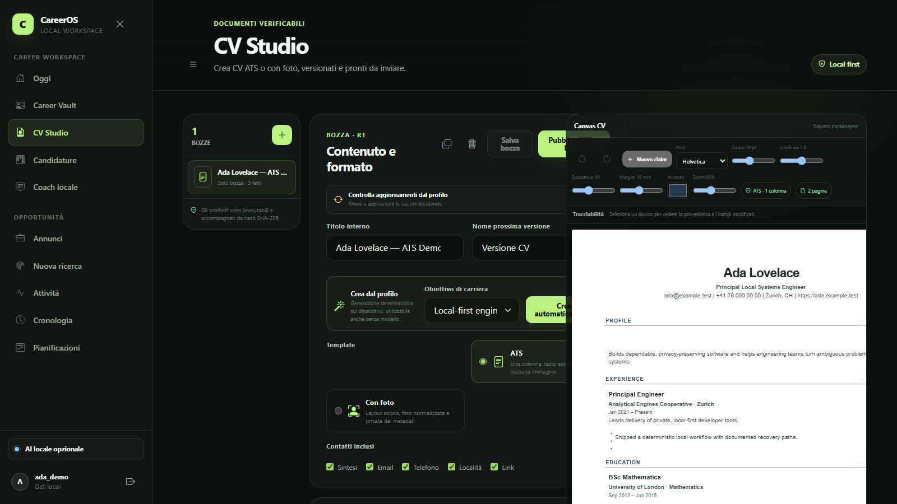
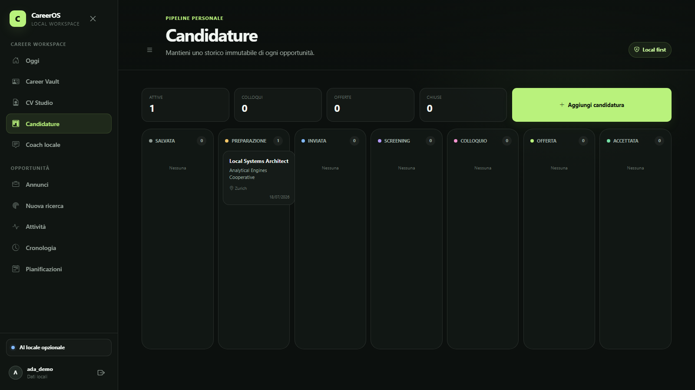
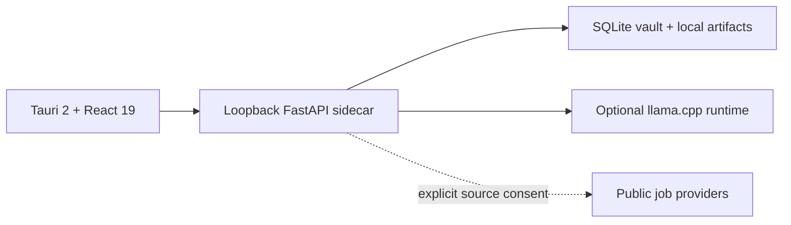

# CareerOS Local

[](https://github.com/ejupi-djenis30/careeros-local/actions/workflows/ci.yml)
[](https://github.com/ejupi-djenis30/careeros-local/releases/latest)
[](LICENSE)


> Turn verified experience into resumes, job matches and an application pipeline—without
> handing your career history to a cloud AI service.

CareerOS Local is a working desktop career workspace built around one principle: professional
data should remain useful, inspectable and owned by the person it describes. It combines a
structured Career Vault, evidence-backed resume production, opportunity matching, application
tracking and optional on-device AI in one private workspace.

[](docs/assets/careeros-demo.webm)

**[Watch the 34-second product tour](docs/assets/careeros-demo.webm)** ·
[Architecture](docs/architecture.md) · [Privacy model](docs/privacy.md) ·
[Reproduce the demo](docs/demo.md)

## Why it matters

- **One source of truth:** career facts carry provenance, verification status and revision
  history instead of becoming untraceable generated claims.
- **Useful without AI:** profile, resume, application, backup and editing workflows remain
  available when no model is installed.
- **Private by architecture:** the API, database, artifacts and optional model runtime stay on
  the device; there is no telemetry or cloud-model fallback.
- **Built for real workflows:** resumes become immutable PDF/DOCX versions, while applications
  retain local job snapshots and an append-only timeline.

## Product tour

| Daily workspace | Career Vault |
| --- | --- |
|  |  |

| Resume Studio | Application pipeline |
| --- | --- |
|  |  |

All captures are generated from a disposable database with a fictional Ada Lovelace profile.
The recorder rejects visible alerts, browser errors and failed API responses before publishing
the assets.

## Engineering highlights

- Tauri 2 owns the desktop shell and supervised FastAPI sidecar lifecycle.
- React 19 provides the keyboard-accessible workspace and editable resume canvas.
- SQLite, SQLAlchemy and Alembic provide transactional storage and migrations.
- Versioned archives restore atomically and exclude private cross-user or runtime state.
- Vault erasure sanitizes SQLite even when artifact cleanup needs a retry.
- Local AI calls use explicit context, strict schemas, bounded repair and content-free audit
  metadata through a managed llama.cpp-compatible runtime.
- CI verifies Python, React and Rust code, migrations, dependency licenses, SBOMs, containers
  and fixed high/critical vulnerabilities.

## Architecture



The local model receives only the context selected for a task. Job-source connectors are a
separate, explicit network boundary used to retrieve public listings; they never become an
inference fallback. See the [architecture](docs/architecture.md),
[privacy model](docs/privacy.md) and [security policy](SECURITY.md) for the complete trust model.

## Technology

| Layer | Stack |
| --- | --- |
| Desktop | Tauri 2, Rust |
| Interface | React 19, Vite, Bootstrap Icons |
| Local API | Python 3.12, FastAPI, Pydantic |
| Data | SQLite, SQLAlchemy, Alembic |
| Documents | ReportLab, python-docx, pypdf, Pillow |
| Optional AI | Managed llama.cpp-compatible runtime, schema-validated pipelines |
| Quality | pytest, Vitest, ESLint, Ruff, mypy, Clippy, Cargo test, Trivy, CycloneDX |

## Run locally

Requirements: Python 3.12, Node.js 24 LTS, npm and Git. Native desktop development additionally
requires Rust stable and the [Tauri prerequisites](https://v2.tauri.app/start/prerequisites/).

```powershell
python -m venv .venv
.venv\Scripts\python.exe -m pip install --require-hashes -r requirements-dev.lock
npm ci --prefix frontend
.venv\Scripts\alembic.exe upgrade head
```

Start the local API and interface in separate terminals:

```powershell
.venv\Scripts\python.exe -m uvicorn backend.main:app --host 127.0.0.1 --port 8000
```

```powershell
npm --prefix frontend run dev -- --host 127.0.0.1
```

Open `http://127.0.0.1:5173`. To create the same disposable fictional workspace used in the
tour, run this only against a development database:

```powershell
.venv\Scripts\python.exe scripts\seed_demo.py --password "CareerOS-Demo-2026!"
```

Then sign in as `ada_demo` with the supplied password. The seeder accepts loopback destinations
only, follows no redirects and does not overwrite unrelated profile data.

For the native shell:

```powershell
npm --prefix frontend run tauri:dev
```

## Reproduce the portfolio media

The media pipeline starts an isolated database and services on free loopback ports, seeds
fictional data, records the real product and removes its temporary vault afterward.

```powershell
npm --prefix frontend run demo:install
npm --prefix frontend run demo:record
```

It outputs a 1280×720 WebM tour, a lightweight animated preview, a poster and four clean
screenshots under `docs/assets/`. Full details are in the [demo recording guide](docs/demo.md).

## Verify

```powershell
.venv\Scripts\python.exe -m ruff check backend tests/backend alembic/versions scripts/seed_demo.py scripts/render_demo_assets.py
.venv\Scripts\python.exe -m mypy backend scripts/seed_demo.py scripts/render_demo_assets.py --ignore-missing-imports --no-error-summary
.venv\Scripts\python.exe -m pytest tests/backend -q
npm --prefix frontend test
npm --prefix frontend run lint
npm --prefix frontend run build
cargo fmt --manifest-path frontend/src-tauri/Cargo.toml --check
cargo clippy --manifest-path frontend/src-tauri/Cargo.toml --locked --all-targets -- -D warnings
cargo test --manifest-path frontend/src-tauri/Cargo.toml --locked
```

Database changes also require an `upgrade head → downgrade -1 → upgrade head` round trip against
a disposable SQLite database.

## Project background

CareerOS Local is a substantial desktop and privacy-focused extension of the earlier Job Hunter
AI codebase, developed during OpenAI Build Week. The work added the Career Vault, grounded resume
studio, application workflow, managed local model lifecycle, secure portability and erasure,
Tauri sidecar integration and expanded Python/React/Rust verification. The detailed, claim-aware
hackathon material remains in the [Devpost submission kit](docs/devpost.md).

## Documentation

- [Development guide](docs/development.md)
- [Demo recording guide](docs/demo.md)
- [Architecture](docs/architecture.md)
- [Privacy model](docs/privacy.md)
- [Release process](docs/releasing.md)
- [Devpost submission kit](docs/devpost.md)
- [Product specification](specs/001-desktop-career-agent/spec.md)
- [Release evidence](specs/001-desktop-career-agent/release-evidence.md)
- [Contributing guide](CONTRIBUTING.md)
- [Changelog](CHANGELOG.md)

## License

CareerOS Local is released under the [MIT License](LICENSE). Third-party runtimes and models
retain their own licenses; the application displays the selected model license before download.
