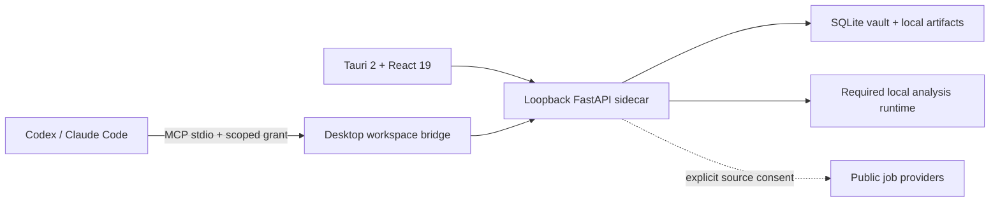

<p align="center">
  
</p>

# CareerOS Local

[](https://github.com/ejupi-djenis30/careeros-local/actions/workflows/ci.yml)
[](https://github.com/ejupi-djenis30/careeros-local/releases/latest)
[](LICENSE)


> Your career history should become more useful over time, not more exposed.

CareerOS Local is an open-source, local-first career utility for turning verified experience into polished
resumes, relevant opportunities, and an application pipeline you can actually operate. Before
anything is sent, a deterministic readiness pack shows exactly what is present, what is missing
and where to fix it. The Career Vault preserves source facts and revision history. Record keeping,
manual applications, document editing, exports, backups, and readiness checks remain available
without a model; opportunity matching and coaching require a ready, approved local runtime.

[](https://ejupi-djenis30.github.io/careeros-local/#demo)

**[Watch the 40-second product tour](https://ejupi-djenis30.github.io/careeros-local/#demo)** ·
[Direct WebM download](https://ejupi-djenis30.github.io/careeros-local/assets/careeros-demo.webm) ·
[Open the portfolio site](https://ejupi-djenis30.github.io/careeros-local/) ·
[View the Devpost project](https://devpost.com/software/careeros-local) ·
[View releases](https://github.com/ejupi-djenis30/careeros-local/releases) ·
[Daily-driver guide](docs/daily-driver.md) · [Architecture](docs/architecture.md) ·
[Privacy model](docs/privacy.md)

## Why CareerOS

- **Trust the record:** career facts retain provenance, verification status, and revision
  history instead of dissolving into untraceable generated claims.
- **Own the useful record:** profile, resume, manual application, backup, export, and editing
  workflows stay available while a model is being installed or repaired.
- **Keep the private parts private:** the API, database, artifacts, and analysis runtime
  remain on the device, with no telemetry and no cloud-model fallback.
- **Move from intent to follow-through:** immutable PDF/DOCX resume versions, local job
  snapshots, a private daily action agenda, verifiable application dossiers and a nine-check
  preflight keep the workflow coherent.

## A search workflow you can keep using

1. Confirm the experience, skills and preferences that belong in the Career Vault.
2. Start a search from that verified record, or deliberately switch to an uploaded CV.
3. Review opportunities whose source, revision and local analysis are recorded instead of
   silently replaced.
4. Track a promising role once. CareerOS opens the same application timeline from then on, with
   its next action, documents and history kept together.

CareerOS does not infer that a listing has closed merely because one provider response omitted it.
When the advert changes, the catalog records a new revision and discards any older analysis still
in flight. Search receipts survive the shorter-lived progress log, so the workspace shows what
actually completed rather than inventing onboarding progress.

## Product tour

| Daily workspace | Career Vault |
| --- | --- |
|  |  |

| Resume Studio | Application pipeline |
| --- | --- |
|  |  |

All captures are generated from a disposable database with the fictional Mira Vale profile.
The recorder rejects visible alerts, browser errors and failed API responses before publishing
the assets.

## Engineering highlights

- Tauri 2 owns the desktop shell and supervised FastAPI sidecar lifecycle.
- React 19 provides the keyboard-accessible workspace and editable resume canvas.
- SQLite, SQLAlchemy and Alembic provide transactional storage and migrations.
- Versioned archives can be inspected without changing the vault, report only content-free
  counts and verification codes, restore atomically into an empty vault, and exclude private
  cross-user or runtime state. Desktop saves verify the server digest before and after the native
  write; portable ZIP checksums detect corruption but do not encrypt the archive or prove its
  author.
- Application readiness is calculated without a model from owned local records, exposes weighted
  evidence and actions, and exports reproducible JSON or Markdown reports.
- Search planning has a deterministic path based only on the role, strategy and preferences the
  user entered. Career Vault is the default source for local matching, but only confirmed,
  non-archived facts enter its bounded and contact-redacted snapshot. Provider queries still come
  only from explicit search intent and preferences. Listings found elsewhere can be imported into
  a private per-user namespace.
- Provider observations update a revisioned catalog before per-profile deduplication. Analysis and
  normalization results carry the revision they were built from and fail closed if a newer advert
  arrives while local-model work is running.
- Job cards resolve their application state in one user-scoped bulk read. Creating a timeline is
  idempotent at both service and database levels, including duplicate provider rows and concurrent
  requests.
- Application tasks are append-only events with a narrow next-action projection and portable
  calendar reminders. Dossier ZIPs include versioned answers, ID-only requirement mappings, one
  deduplicated evidence catalog, verified resume files and a canonical SHA-256 manifest.
- The daily application agenda reads only owned scalar projections. It orders overdue, today,
  upcoming, undated and missing next actions without replaying private event payloads or requiring
  the model, and reports actions omitted by its seven-day horizon or compact row limit. Counts and
  rows share one SQL-statement snapshot; the renderer supplies the next browser-local midnight so
  today remains correct across daylight-saving transitions.
- The native bundle gives Codex and Claude Code a restart-aware stdio MCP bridge to owner-created
  discover, analyze and materials work. It exposes bounded frozen context and accepts strict
  proposals; review, acceptance, publication, transmission and grant management stay in CareerOS.
  The older wheel-based read-only interface remains available as a separate offline mode.
- Vault erasure sanitizes SQLite even when artifact cleanup needs a retry.
- Local AI calls use explicit context, strict schemas, bounded repair and content-free audit
  metadata through a managed llama.cpp-compatible runtime.
- CI verifies Python, React and Rust code, migrations, dependency licenses, SBOMs, containers
  and fixed high/critical vulnerabilities.

Current accepted dependency risks, their owners, controls, and expiry dates are recorded in the
[security policy](SECURITY.md#active-dependency-exceptions).

## Architecture


```mermaid
flowchart LR
    UI["Tauri 2 + React 19"] --> API["Loopback FastAPI sidecar"]
    API --> Vault["SQLite vault + local artifacts"]
    API --> AI["Required local analysis runtime"]
    API -. "explicit source consent" .-> Jobs["Public job providers"]
    Agent["Codex / Claude Code"] -->|"MCP stdio + scoped grant"| Bridge["Desktop workspace bridge"]
    Bridge --> API
```

The local model receives only the context selected for a task. Job-source connectors are a
separate, explicit network boundary used to retrieve public listings; they never become an
inference fallback. The installed MCP bridge talks only to the authenticated loopback sidecar and
never opens the vault itself. The preserved offline CLI/MCP mode still uses the desktop vault lease.
See the [architecture](docs/architecture.md),
[privacy model](docs/privacy.md) and [security policy](SECURITY.md) for the complete trust model.

## Technology

| Layer | Stack |
| --- | --- |
| Desktop | Tauri 2, Rust |
| Interface | React 19, Vite, Bootstrap Icons |
| Local API | Python 3.12, FastAPI, Pydantic |
| Data | SQLite, SQLAlchemy, Alembic |
| Documents | ReportLab, python-docx, pypdf, Pillow |
| Local analysis | Managed llama.cpp-compatible runtime, schema-validated pipelines |
| Quality | pytest, Vitest, ESLint, Ruff, mypy, Clippy, Cargo test, Trivy, CycloneDX |

## Install the desktop app

Download the latest community build from [GitHub Releases](https://github.com/ejupi-djenis30/careeros-local/releases/latest).

| Platform | Choose this asset |
| --- | --- |
| Windows x64 / ARM64 | `windows-*-setup.exe` for the guided installer, or `windows-*.msi` for managed deployment |
| macOS Apple Silicon / Intel | `macos-arm64.dmg` or `macos-x64.dmg` |
| Linux x64 / ARM64 | `linux-*.AppImage` for a portable app, or `linux-*.deb` on Debian-based systems |

These are unsigned community builds. Before installing, compare the file with `SHA256SUMS` and
verify its GitHub attestation:

```shell
gh attestation verify <downloaded-file> --repo ejupi-djenis30/careeros-local
```

The app keeps its vault in the operating system's private application-data directory. Removing
the app does not silently erase that data. If you want a clean removal, export anything you need,
use the in-app vault erasure flow, and then uninstall the package.

### Get to a first useful result

Create a local account, then choose **Start from a CV** on the Today page. You can select a TXT,
Markdown, PDF or DOCX file before filling out the long profile form. CareerOS creates the minimum
local Vault record, reads the document on this device and shows candidate facts for review. It does
not confirm them for you: accept only accurate candidates, choose **Review imported facts**, mark
the facts you have checked as confirmed, and save the Career Vault.

Install the listed local model from the same Today page when you are ready to match opportunities.
Model acquisition requires the displayed license consent and is separate from the CV import. Before
the first provider search, enable only the job sources you want under Career Vault preferences.

## Run locally

Requirements: Python 3.12, Node.js 24.18.0 (`>=24.18.0 <25`; pinned in `.nvmrc`), npm and Git. Native desktop development additionally
requires Rust stable and the [Tauri prerequisites](https://v2.tauri.app/start/prerequisites/).

```powershell
python -m venv .venv
.venv\Scripts\python.exe -m pip install --require-hashes -r requirements-dev.lock
npm ci --prefix frontend
.venv\Scripts\python.exe -m alembic upgrade head
```

Start the local API and interface in separate terminals:

```powershell
.venv\Scripts\python.exe -m uvicorn backend.main:app --host 127.0.0.1 --port 8000
```

```powershell
npm --prefix frontend run dev -- --host 127.0.0.1
```

Open `http://127.0.0.1:5173`. To create the same disposable fictional workspace used in the
tour, run this only against a development database:

```powershell
.venv\Scripts\python.exe scripts\seed_demo.py --password "MiraDemo2026!"
```

Then sign in as `mira_demo` with the supplied password. The seeder accepts loopback destinations
only, follows no redirects, does not overwrite unrelated profile data, publishes locally verified
PDF/DOCX files and confirms that the fictional application reaches 100/100 preflight completeness.

For the native shell:

```powershell
.venv\Scripts\python.exe -m pip install --require-hashes -r requirements-tooling.lock
npm --prefix frontend run tauri:dev
```

## Use CareerOS from Codex or Claude Code

The native application now includes a console MCP bridge for Codex and Claude Code. Keep CareerOS
open, create an **Agent access** grant with `context:read` and `proposals:write`, and copy the
token-free Codex TOML or Claude JSON shown by the app. The generated setup uses the actual installed
`careeros-mcp` path plus a private restart-aware connection descriptor; it does not depend on a
source checkout, a global Python installation, or a fixed ephemeral port.

Set the one-time bearer only in the environment that starts the client:

```powershell
$env:CAREEROS_MCP_TOKEN = "<retrieve from your credential manager>"
codex
# or: claude
```

Then create a **Discover**, **Analyze**, or **Materials** request in **Agent Workspace**. The client
uses six fixed MCP tools to list assigned work, fetch its frozen bounded context, submit one strict
evidence-grounded proposal, and report its review state. CareerOS remains the approval boundary:
MCP cannot confirm facts, accept proposals, publish CVs or packets, send email, submit applications,
manage grants, read arbitrary files, execute SQL, or run shell commands.

The connected client may send selected context to its own model provider. Grant only the facts and
targets needed for the task, use a short expiry, keep `CAREEROS_MCP_TOKEN` out of configuration and
source control, and revoke it after use.

A source-checkout developer connection remains available while the loopback backend is running:

```powershell
.venv\Scripts\python.exe -m pip install --no-deps -e .
.venv\Scripts\careeros.exe mcp serve --desktop-url http://127.0.0.1:8000/api/v1 `
  --acknowledge-agent-disclosure
```

The preserved wheel-based `--data-dir` mode is a separate, offline read-only interface. Close the
desktop before using that legacy mode because it takes the vault lease. Do not combine
`--data-dir`, `--desktop-url`, and `--connection-file`.

An explicit offline campaign-maintenance workflow is also available when the desktop is closed.
Preview is side-effect free; import requires the exact preview fingerprint, an explicitly named
local account, and a separate write acknowledgement. The existing archive allowlist removes the
credentials sheet before persistence, and the normal exclusive vault lease and migration backup
remain authoritative.

```powershell
careeros campaign preview "C:\absolute\campaign.zip"
careeros --data-dir "C:\absolute\app-data" campaign import "C:\absolute\campaign.zip" `
  --username <local-account> --expected-fingerprint <sha256-from-preview> `
  --profile-display-name "Candidate Name" --name "September campaign" `
  --acknowledge-local-vault-write
careeros --data-dir "C:\absolute\app-data" campaign list --username <local-account>
careeros --data-dir "C:\absolute\app-data" campaign show <campaign-id> `
  --username <local-account> --query APP-20260920 --limit 200
careeros --data-dir "C:\absolute\app-data" campaign show <campaign-id> `
  --username <local-account> --stage preparing --review-decision excluded
careeros --data-dir "C:\absolute\app-data" campaign record-review <campaign-id> `
  <source-application-id> --username <local-account> --expected-revision <revision> `
  --decision hold --reason "Official listing does not confirm the office location" `
  --source-url "https://jobs.example.org/roles/123" `
  --next-action "Verify the normal workplace with the employer" `
  --acknowledge-review-record-write
careeros --data-dir "C:\absolute\app-data" campaign record-submission <campaign-id> `
  <source-application-id> --username <local-account> --expected-revision <revision> `
  --channel <portal> --confirmation <portal-confirmation> --resume-sha256 <sha256> `
  --acknowledge-submission-record-write
careeros --data-dir "C:\absolute\app-data" campaign record-outcome <campaign-id> `
  <source-application-id> --username <local-account> --expected-revision <revision> `
  --source-kind email --source-date 2026-09-01 `
  --evidence "Recruiting email names this role and declines the application" `
  --acknowledge-outcome-record-write
```

These commands never submit applications or send files. `campaign list` and `campaign show` are
owner-scoped reads. Import, `record-review`, `record-submission`, and `record-outcome` are explicit local-vault writes
and cannot run alongside the desktop's writable vault process. `record-review` appends an
evidence-backed `hold`, `excluded`, or `cleared` decision to a saved/preparing application's
timeline without changing its stage. A hold requires a concrete next action, but does not yet
create a scheduled agenda task. `cleared` removes the recorded review block; it is not a readiness
or fit certification. `campaign show` displays the latest review separately as `review`.
Use `--review-decision none|hold|excluded|cleared` to inspect one current review class;
filtering happens before `--offset`/`--limit` and updates `filtered_application_count`.
`none` only means that no valid review decision is recorded, not that a vacancy is eligible
or ready to send. Combine it with `--stage` to inspect a particular pipeline stage.
`record-submission` only records a submission that the portal has already confirmed; it never
contacts an employer.
`record-outcome` appends a sourced `rejected` stage only after an application reached a
post-submission stage. The source date is evidence metadata; the immutable event timestamp is
the time CareerOS recorded the correction. It does not send a reply to the employer.
In `campaign list` and `campaign show`, `summary.status_counts` is the historical tracker-import
snapshot (`summary_scope: import_snapshot`). `campaign show` also returns `live_stage_counts` for
the entire current campaign, independent of display filters or pagination.

<details>
<summary>Hash-locked installation of the legacy wheel interface</summary>

Build the wheel from the reviewed checkout with the matching development lock, without resolving
dependencies from the network during the wheel step:

```powershell
py -3.12 -m venv .wheel-build
.\.wheel-build\Scripts\python.exe -m pip install --require-hashes -r requirements-dev.lock
.\.wheel-build\Scripts\python.exe -m pip wheel --no-build-isolation --no-deps --wheel-dir dist .
```

Install the wheel and `requirements.lock` from the same release into a dedicated environment.
Keep the executable path explicit in the legacy MCP configuration.

```powershell
py -3.12 -m venv "$env:LOCALAPPDATA\CareerOS\agent-cli"
& "$env:LOCALAPPDATA\CareerOS\agent-cli\Scripts\python.exe" -m pip install --require-hashes -r requirements.lock
& "$env:LOCALAPPDATA\CareerOS\agent-cli\Scripts\python.exe" -m pip install --no-deps .\dist\careeros_local-*.whl
```

```bash
# macOS
python3.12 -m venv "$HOME/Library/Application Support/CareerOS/agent-cli"
"$HOME/Library/Application Support/CareerOS/agent-cli/bin/python" -m pip install --require-hashes -r requirements.lock
"$HOME/Library/Application Support/CareerOS/agent-cli/bin/python" -m pip install --no-deps ./dist/careeros_local-*.whl
```

```bash
# Linux
python3.12 -m venv "${XDG_DATA_HOME:-$HOME/.local/share}/careeros-agent-cli"
"${XDG_DATA_HOME:-$HOME/.local/share}/careeros-agent-cli/bin/python" -m pip install --require-hashes -r requirements.lock
"${XDG_DATA_HOME:-$HOME/.local/share}/careeros-agent-cli/bin/python" -m pip install --no-deps ./dist/careeros_local-*.whl
```

</details>

See the [Codex and Claude Code workspace guide](docs/agent-workspace.md) for client setup, the exact
tool sequence, review and acceptance, the nine CV presets, application packet generation, and
Career-style source imports.

## Reproduce the portfolio media

The media pipeline starts an isolated database and services on free loopback ports, seeds
fictional data, records the real product and removes its temporary vault afterward.

```powershell
npm --prefix frontend run demo:install
npm --prefix frontend run demo:record
```

It outputs a 1280×720 WebM tour, a lightweight animated preview, a poster and four clean
screenshots under `docs/assets/`. Full details are in the [demo recording guide](docs/demo.md).

## Verify

```powershell
.venv\Scripts\python.exe -m ruff check backend tests/backend scripts
.venv\Scripts\python.exe -m mypy backend scripts --ignore-missing-imports --no-error-summary
.venv\Scripts\python.exe -m pytest tests/backend -q --cov=backend --cov-branch --cov-fail-under=80
npm --prefix frontend run test:coverage
npm --prefix frontend run demo:install
npm --prefix frontend run test:e2e
npm --prefix frontend run lint
npm --prefix frontend run build
cargo fmt --manifest-path frontend/src-tauri/Cargo.toml --check
cargo clippy --manifest-path frontend/src-tauri/Cargo.toml --locked --all-targets -- -D warnings
cargo test --manifest-path frontend/src-tauri/Cargo.toml --locked
```

Database changes also require an `upgrade head → downgrade -1 → upgrade head` round trip against
a disposable SQLite database.

## Project background

CareerOS Local is a substantial desktop and privacy-focused extension of the earlier Job Hunter
AI codebase, developed during OpenAI Build Week. The work added the Career Vault, grounded resume
studio, application workflow, managed local model lifecycle, secure portability and erasure,
Tauri sidecar integration and expanded Python/React/Rust verification. The detailed, claim-aware
hackathon material remains in the [Devpost submission kit](docs/devpost.md).

Product direction and maintenance stay with the project maintainers. Additional work is credited
collectively to **CareerOS Local contributors**.

## Documentation

- [Development guide](docs/development.md)
- [Brand system](docs/brand.md)
- [Demo recording guide](docs/demo.md)
- [Architecture](docs/architecture.md)
- [Privacy model](docs/privacy.md)
- [Release process](docs/releasing.md)
- [Devpost submission kit](docs/devpost.md)
- [Product specification](specs/001-desktop-career-agent/spec.md)
- [CV-first first-use analysis](specs/001-desktop-career-agent/cv-first-analysis.md)
- [CV-first first-use convergence](specs/001-desktop-career-agent/cv-first-convergence.md)
- [Agent interface analysis](specs/001-desktop-career-agent/agent-interface-analysis.md)
- [Agent interface convergence](specs/001-desktop-career-agent/agent-interface-convergence.md)
- [v1.11.1 release evidence](docs/release-evidence-v1.11.1.md)
- [v1.11.0 unpublished candidate record](docs/release-evidence-v1.11.0.md)
- [v1.10.0 release evidence](docs/release-evidence-v1.10.0.md)
- [v1.9.0 release evidence](docs/release-evidence-v1.9.0.md)
- [v1.8.0 release preparation](specs/001-desktop-career-agent/release-evidence-v1.8.0.md)
- [v1.7.0 release preparation](specs/001-desktop-career-agent/release-evidence-v1.7.0.md)
- [v1.6.0 release preparation](specs/001-desktop-career-agent/release-evidence-v1.6.0.md)
- [v1.5.0 release preparation](specs/001-desktop-career-agent/release-evidence-v1.5.0.md)
- [v1.4.0 release preparation](specs/001-desktop-career-agent/release-evidence-v1.4.0.md)
- [v1.3.0 release preparation](specs/001-desktop-career-agent/release-evidence-v1.3.0.md)
- [v1.2.0 release preparation](specs/001-desktop-career-agent/release-evidence-v1.2.0.md)
- [v1.1.0 release preparation](specs/001-desktop-career-agent/release-evidence-v1.1.0.md)
- [v1.0.2 release evidence](specs/001-desktop-career-agent/release-evidence-v1.0.2.md)
- [Historical v1.0.0 Windows evidence](specs/001-desktop-career-agent/release-evidence.md)
- [Contributing guide](CONTRIBUTING.md)
- [Changelog](CHANGELOG.md)

## License

CareerOS Local is released under the [MIT License](LICENSE). Third-party runtimes and models
retain their own licenses. Runtime dependency copyright and license texts are shipped in the
lock-bound [third-party notices](THIRD_PARTY_NOTICES.txt); the application separately displays
the selected model license before download.
