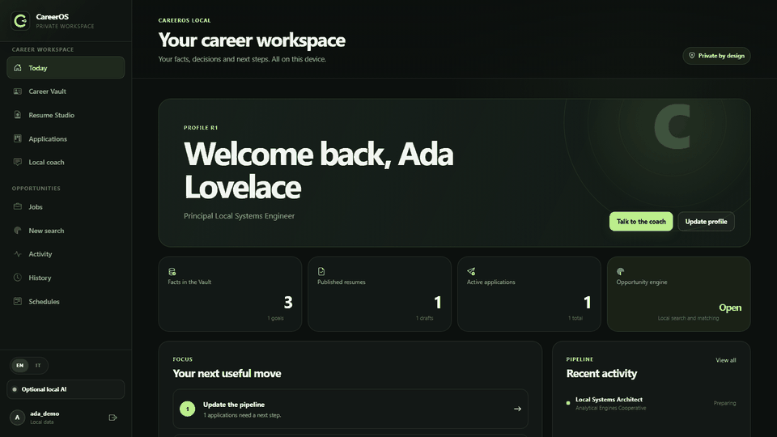
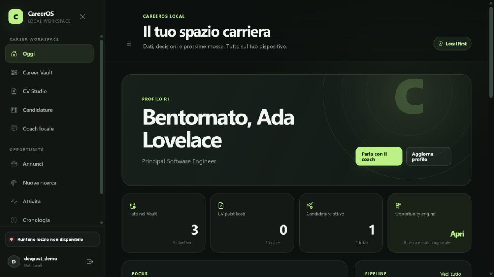
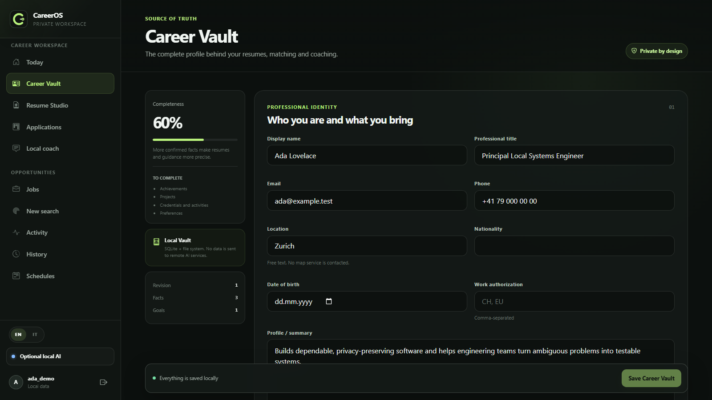
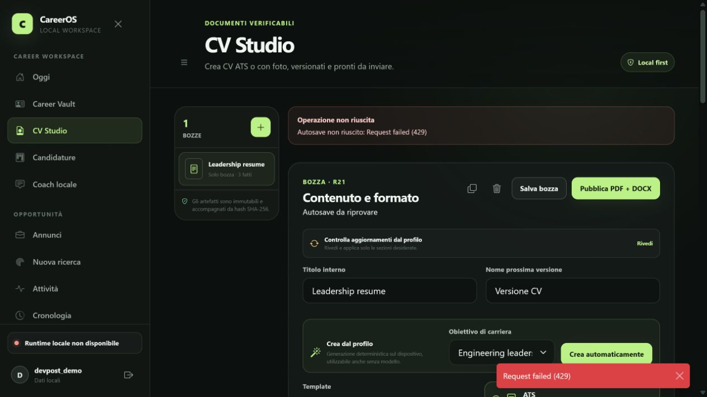
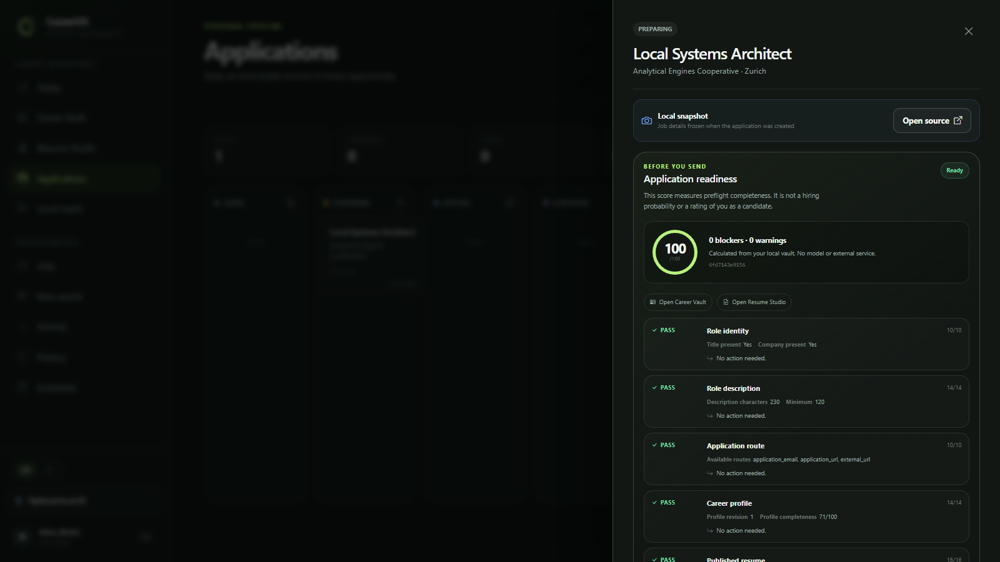
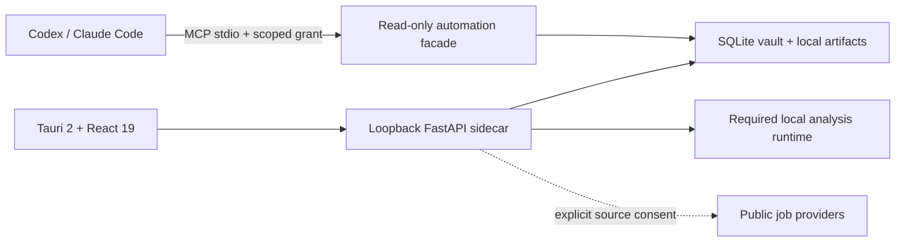

<p align="center">
  
</p>

# CareerOS Local

[](https://github.com/ejupi-djenis30/careeros-local/actions/workflows/ci.yml)
[](https://github.com/ejupi-djenis30/careeros-local/releases/latest)
[](LICENSE)


> Your career history should become more useful over time, not more exposed.

CareerOS Local is an open-source, local-first career utility for turning verified experience into polished
resumes, relevant opportunities, and an application pipeline you can actually operate. Before
anything is sent, a deterministic readiness pack shows exactly what is present, what is missing
and where to fix it. The Career Vault preserves source facts and revision history. Record keeping,
manual applications, document editing, exports, backups, and readiness checks remain available
without a model; opportunity matching and coaching require a ready, approved local runtime.

[](https://ejupi-djenis30.github.io/careeros-local/#demo)

**[Watch the 40-second product tour](https://ejupi-djenis30.github.io/careeros-local/#demo)** ·
[Direct WebM download](https://ejupi-djenis30.github.io/careeros-local/assets/careeros-demo.webm) ·
[Open the portfolio site](https://ejupi-djenis30.github.io/careeros-local/) ·
[View the Devpost project](https://devpost.com/software/careeros-local) ·
[View releases](https://github.com/ejupi-djenis30/careeros-local/releases) ·
[Daily-driver guide](docs/daily-driver.md) · [Architecture](docs/architecture.md) ·
[Privacy model](docs/privacy.md)

## Why CareerOS

- **Trust the record:** career facts retain provenance, verification status, and revision
  history instead of dissolving into untraceable generated claims.
- **Own the useful record:** profile, resume, manual application, backup, export, and editing
  workflows stay available while a model is being installed or repaired.
- **Keep the private parts private:** the API, database, artifacts, and analysis runtime
  remain on the device, with no telemetry and no cloud-model fallback.
- **Move from intent to follow-through:** immutable PDF/DOCX resume versions, local job
  snapshots, a private daily action agenda, verifiable application dossiers and a nine-check
  preflight keep the workflow coherent.

## A search workflow you can keep using

1. Confirm the experience, skills and preferences that belong in the Career Vault.
2. Start a search from that verified record, or deliberately switch to an uploaded CV.
3. Review opportunities whose source, revision and local analysis are recorded instead of
   silently replaced.
4. Track a promising role once. CareerOS opens the same application timeline from then on, with
   its next action, documents and history kept together.

CareerOS does not infer that a listing has closed merely because one provider response omitted it.
When the advert changes, the catalog records a new revision and discards any older analysis still
in flight. Search receipts survive the shorter-lived progress log, so the workspace shows what
actually completed rather than inventing onboarding progress.

## Product tour

| Daily workspace | Career Vault |
| --- | --- |
|  |  |

| Resume Studio | Application pipeline |
| --- | --- |
|  |  |

All captures are generated from a disposable database with the fictional Mira Vale profile.
The recorder rejects visible alerts, browser errors and failed API responses before publishing
the assets.

## Engineering highlights

- Tauri 2 owns the desktop shell and supervised FastAPI sidecar lifecycle.
- React 19 provides the keyboard-accessible workspace and editable resume canvas.
- SQLite, SQLAlchemy and Alembic provide transactional storage and migrations.
- Versioned archives can be inspected without changing the vault, report only content-free
  counts and verification codes, restore atomically into an empty vault, and exclude private
  cross-user or runtime state. Desktop saves verify the server digest before and after the native
  write; portable ZIP checksums detect corruption but do not encrypt the archive or prove its
  author.
- Application readiness is calculated without a model from owned local records, exposes weighted
  evidence and actions, and exports reproducible JSON or Markdown reports.
- Search planning has a deterministic path based only on the role, strategy and preferences the
  user entered. Career Vault is the default source for local matching, but only confirmed,
  non-archived facts enter its bounded and contact-redacted snapshot. Provider queries still come
  only from explicit search intent and preferences. Listings found elsewhere can be imported into
  a private per-user namespace.
- Provider observations update a revisioned catalog before per-profile deduplication. Analysis and
  normalization results carry the revision they were built from and fail closed if a newer advert
  arrives while local-model work is running.
- Job cards resolve their application state in one user-scoped bulk read. Creating a timeline is
  idempotent at both service and database levels, including duplicate provider rows and concurrent
  requests.
- Application tasks are append-only events with a narrow next-action projection and portable
  calendar reminders. Dossier ZIPs include versioned answers, ID-only requirement mappings, one
  deduplicated evidence catalog, verified resume files and a canonical SHA-256 manifest.
- The daily application agenda reads only owned scalar projections. It orders overdue, today,
  upcoming, undated and missing next actions without replaying private event payloads or requiring
  the model, and reports actions omitted by its seven-day horizon or compact row limit. Counts and
  rows share one SQL-statement snapshot; the renderer supplies the next browser-local midnight so
  today remains correct across daylight-saving transitions.
- A separately installed `careeros` command gives Codex, Claude Code and shell scripts a narrow
  read-only view of one explicitly authorized account. Its MCP server uses standard input/output
  rather than a network listener, exposes only tools allowed by a revocable grant, and never
  returns resume bodies, source documents, dedicated contact records, prompts, artifact bytes or
  storage paths. User-authored labels, company names, locations and task titles can still contain
  sensitive text, so grant only the scopes you are prepared to disclose to the connected agent.
- Vault erasure sanitizes SQLite even when artifact cleanup needs a retry.
- Local AI calls use explicit context, strict schemas, bounded repair and content-free audit
  metadata through a managed llama.cpp-compatible runtime.
- CI verifies Python, React and Rust code, migrations, dependency licenses, SBOMs, containers
  and fixed high/critical vulnerabilities.

Current accepted dependency risks, their owners, controls, and expiry dates are recorded in the
[security policy](SECURITY.md#active-dependency-exceptions).

## Architecture


```mermaid
flowchart LR
    UI["Tauri 2 + React 19"] --> API["Loopback FastAPI sidecar"]
    API --> Vault["SQLite vault + local artifacts"]
    API --> AI["Required local analysis runtime"]
    API -. "explicit source consent" .-> Jobs["Public job providers"]
    Agent["Codex / Claude Code"] -->|"MCP stdio + scoped grant"| Automation["Read-only automation facade"]
    Automation --> Vault
```

The local model receives only the context selected for a task. Job-source connectors are a
separate, explicit network boundary used to retrieve public listings; they never become an
inference fallback. CLI commands and MCP tool calls use the same exclusive lease as the desktop
sidecar, so two processes never read or write the vault at the same instant. An idle MCP process
does not reserve the lease. See the [architecture](docs/architecture.md),
[privacy model](docs/privacy.md) and [security policy](SECURITY.md) for the complete trust model.

## Technology

| Layer | Stack |
| --- | --- |
| Desktop | Tauri 2, Rust |
| Interface | React 19, Vite, Bootstrap Icons |
| Local API | Python 3.12, FastAPI, Pydantic |
| Data | SQLite, SQLAlchemy, Alembic |
| Documents | ReportLab, python-docx, pypdf, Pillow |
| Local analysis | Managed llama.cpp-compatible runtime, schema-validated pipelines |
| Quality | pytest, Vitest, ESLint, Ruff, mypy, Clippy, Cargo test, Trivy, CycloneDX |

## Install the desktop app

Download the latest community build from [GitHub Releases](https://github.com/ejupi-djenis30/careeros-local/releases/latest).

| Platform | Choose this asset |
| --- | --- |
| Windows x64 / ARM64 | `windows-*-setup.exe` for the guided installer, or `windows-*.msi` for managed deployment |
| macOS Apple Silicon / Intel | `macos-arm64.dmg` or `macos-x64.dmg` |
| Linux x64 / ARM64 | `linux-*.AppImage` for a portable app, or `linux-*.deb` on Debian-based systems |

These are unsigned community builds. Before installing, compare the file with `SHA256SUMS` and
verify its GitHub attestation:

```shell
gh attestation verify <downloaded-file> --repo ejupi-djenis30/careeros-local
```

The app keeps its vault in the operating system's private application-data directory. Removing
the app does not silently erase that data. If you want a clean removal, export anything you need,
use the in-app vault erasure flow, and then uninstall the package.

### Get to a first useful result

Create a local account, then choose **Start from a CV** on the Today page. You can select a TXT,
Markdown, PDF or DOCX file before filling out the long profile form. CareerOS creates the minimum
local Vault record, reads the document on this device and shows candidate facts for review. It does
not confirm them for you: accept only accurate candidates, choose **Review imported facts**, mark
the facts you have checked as confirmed, and save the Career Vault.

Install the listed local model from the same Today page when you are ready to match opportunities.
Model acquisition requires the displayed license consent and is separate from the CV import. Before
the first provider search, enable only the job sources you want under Career Vault preferences.

## Run locally

Requirements: Python 3.12, Node.js 24 LTS, npm and Git. Native desktop development additionally
requires Rust stable and the [Tauri prerequisites](https://v2.tauri.app/start/prerequisites/).

```powershell
python -m venv .venv
.venv\Scripts\python.exe -m pip install --require-hashes -r requirements-dev.lock
npm ci --prefix frontend
.venv\Scripts\python.exe -m alembic upgrade head
```

Start the local API and interface in separate terminals:

```powershell
.venv\Scripts\python.exe -m uvicorn backend.main:app --host 127.0.0.1 --port 8000
```

```powershell
npm --prefix frontend run dev -- --host 127.0.0.1
```

Open `http://127.0.0.1:5173`. To create the same disposable fictional workspace used in the
tour, run this only against a development database:

```powershell
.venv\Scripts\python.exe scripts\seed_demo.py --password "MiraDemo2026!"
```

Then sign in as `mira_demo` with the supplied password. The seeder accepts loopback destinations
only, follows no redirects, does not overwrite unrelated profile data, publishes locally verified
PDF/DOCX files and confirms that the fictional application reaches 100/100 preflight completeness.

For the native shell:

```powershell
.venv\Scripts\python.exe -m pip install --require-hashes -r requirements-tooling.lock
npm --prefix frontend run tauri:dev
```

## Use CareerOS from Codex or Claude Code

Agent Access is packaged as a Python wheel, separately from the desktop app. The desktop installers
do not add `careeros` to `PATH`. The v1.10.0 release contract treats
`careeros_local-1.10.0-py3-none-any.whl` and `requirements.lock` as one installable pair. Download
both from the same release, compare them with `SHA256SUMS`, and verify their GitHub provenance:

```shell
gh attestation verify careeros_local-1.10.0-py3-none-any.whl \
  --repo ejupi-djenis30/careeros-local \
  --source-ref refs/tags/v1.10.0
gh attestation verify requirements.lock \
  --repo ejupi-djenis30/careeros-local \
  --source-ref refs/tags/v1.10.0
```

If either asset is absent, do not combine files from different releases. Build the wheel from the
exact reviewed tag or commit you intend to run and keep that checkout's `requirements.lock` beside
it.

```powershell
# From a reviewed CareerOS checkout, with Python 3.12 or 3.13:
py -3.12 -m venv .wheel-build
.\.wheel-build\Scripts\python.exe -m pip install --require-hashes -r requirements-dev.lock
.\.wheel-build\Scripts\python.exe -m pip wheel --no-build-isolation --no-deps `
  --wheel-dir dist .
```

```bash
# From a reviewed CareerOS checkout, with Python 3.12 or 3.13:
python3.12 -m venv .wheel-build
.wheel-build/bin/python -m pip install --require-hashes -r requirements-dev.lock
.wheel-build/bin/python -m pip wheel --no-build-isolation --no-deps \
  --wheel-dir dist .
```

Install the resulting wheel into a dedicated environment. Keeping its executable path explicit
means Codex or Claude Code can start it without relying on an activated development checkout.

### Windows

```powershell
$agentHome = Join-Path $env:LOCALAPPDATA "CareerOS\agent-cli"
py -3.12 -m venv $agentHome
$agentPython = Join-Path $agentHome "Scripts\python.exe"
$wheel = Get-Item -LiteralPath .\dist\careeros_local-1.10.0-py3-none-any.whl `
  -ErrorAction Stop
$wheelInventory = @(Get-ChildItem -LiteralPath .\dist -Filter "careeros_local-*.whl")
if ($wheelInventory.Count -ne 1 -or $wheelInventory[0].FullName -ne $wheel.FullName) {
  throw "dist must contain only the reviewed CareerOS 1.10.0 wheel"
}
$requirementsLock = (Resolve-Path .\requirements.lock).Path
& $agentPython -m pip install --require-hashes --requirement $requirementsLock
& $agentPython -m pip install --no-deps $wheel.FullName
$careeros = Join-Path $agentHome "Scripts\careeros.exe"
& $careeros --help
& $careeros doctor
```

### macOS

```bash
agent_home="$HOME/Library/Application Support/CareerOS/agent-cli"
python3.12 -m venv "$agent_home"
requirements_lock="/absolute/path/to/requirements.lock"
wheel="/absolute/path/to/careeros_local-<version>-py3-none-any.whl"
"$agent_home/bin/python" -m pip install --require-hashes --requirement "$requirements_lock"
"$agent_home/bin/python" -m pip install --no-deps "$wheel"
careeros_cli="$agent_home/bin/careeros"
"$careeros_cli" --help
"$careeros_cli" doctor
```

### Linux

```bash
agent_home="${XDG_DATA_HOME:-$HOME/.local/share}/careeros-agent-cli"
python3.12 -m venv "$agent_home"
requirements_lock="/absolute/path/to/requirements.lock"
wheel="/absolute/path/to/careeros_local-<version>-py3-none-any.whl"
"$agent_home/bin/python" -m pip install --require-hashes --requirement "$requirements_lock"
"$agent_home/bin/python" -m pip install --no-deps "$wheel"
careeros_cli="$agent_home/bin/careeros"
"$careeros_cli" --help
"$careeros_cli" doctor
```

`doctor` prints JSON and does not create or change a vault. By default the command inspects the
same native application-data directory as the desktop app:

| Platform | Default CareerOS data directory |
| --- | --- |
| Windows | `%APPDATA%\local.careeros.desktop` |
| macOS | `~/Library/Application Support/local.careeros.desktop` |
| Linux | `$XDG_DATA_HOME/local.careeros.desktop` when set; otherwise `~/.local/share/local.careeros.desktop` |

Pass an absolute `--data-dir` before the subcommand only when the desktop was deliberately started
with a different location. If `doctor` reports `vault_not_found`, open the desktop app once with the
same operating-system account and check the path before proceeding.

Open the desktop app, sign in and choose **Agent access** in the Career workspace. Name the client,
select only the reads it needs, choose an expiry and confirm with your current CareerOS password.
The new bearer appears once. CareerOS keeps only its SHA-256 digest, so save the bearer in the
operating system's credential manager before dismissing the panel. The page never copies it
automatically or writes it to browser storage. While a bearer is being issued, CareerOS keeps you
on that page. If the session must end, it waits for the response and revokes any completed grant
before signing out.

The same page shows active, expired and revoked grants, supports password-confirmed revocation and
provides token-free Codex and Claude Code setup snippets. Close the desktop app before the agent
makes a tool call. CareerOS gives the desktop and agent the same exclusive vault lease rather than
letting two processes read it at once. Repeated failed password checks pause new grant creation for
that account. During that lockout, CareerOS does not inspect any password submitted to the revoke
route: the already authenticated desktop session may only reduce its own authority by revoking an
owned grant. New issuance stays locked until the timer expires.

The terminal flow remains available for scripts and recovery. Close the desktop, check the local
setup and create a 30-day grant with only the reads the agent needs:

```powershell
& $careeros doctor
& $careeros authorize --username <your-username> --label codex `
  --scope system:read --scope applications:read
```

```bash
"$careeros_cli" doctor
"$careeros_cli" authorize --username <your-username> --label codex \
  --scope system:read --scope applications:read
```

`authorize` asks for the CareerOS password in the terminal and follows the same one-time token
contract as the desktop. Expose the saved bearer to the agent process as
`CAREEROS_MCP_TOKEN`. Retrieve it from the operating system's credential manager when starting the
client. Do not put the value in `config.toml`, `.mcp.json`, a project `.env`, a shell startup file,
a prompt or a commit. These placeholders show only which process environment must receive it:

```powershell
$env:CAREEROS_MCP_TOKEN = "<retrieve from your credential manager>"
& $careeros mcp config --client codex
```

```bash
export CAREEROS_MCP_TOKEN="<retrieve from your credential manager>"
"$careeros_cli" mcp config --client codex
```

The command prints a table for the Codex user configuration at `~/.codex/config.toml`. It includes
the resolved absolute CareerOS data directory and asks Codex to pass
`CAREEROS_MCP_TOKEN` from its own environment. If the dedicated environment is not on `PATH`,
replace `command = "careeros"` with the absolute executable above. In Windows TOML, write that
path with forward slashes or escaped backslashes.

Register the same stdio server with Claude Code from a shell that already has
`CAREEROS_MCP_TOKEN`:

```powershell
claude mcp add --scope user careeros -- "$careeros" mcp serve `
  --acknowledge-agent-disclosure
```

```bash
claude mcp add --scope user careeros -- "$careeros_cli" mcp serve \
  --acknowledge-agent-disclosure
```

Add `--data-dir "<absolute CareerOS data directory>"` immediately after the executable if you do
not use the native default. User scope keeps the server registration out of a project repository;
it does not store the token. Restart Codex or Claude Code after injecting a new token so the MCP
child inherits it.

The acknowledgement flag matters. The stdio server opens no network listener, and ordinary vault
reads generate no outbound or cloud traffic. `model-status` and the MCP
`get_local_model_status` tool may make a content-free HTTP readiness probe to the configured,
allowlisted local-runtime endpoint. That endpoint is loopback by default; a container deployment
may explicitly allow a single-label runtime alias such as `ollama` or `host.docker.internal`. The
probe sends no Career Vault content and does not contact a cloud-model provider. The connected
agent is a separate trust boundary and may send returned application, resume or career metadata to
its own provider.

At least one `--scope` is required. Repeat it only for the reads this agent should receive:

```powershell
& $careeros authorize --username <your-username> --label applications `
  --scope system:read --scope applications:read --days 7
```

```bash
"$careeros_cli" authorize --username <your-username> --label applications \
  --scope system:read --scope applications:read --days 7
```

Available MCP tools are `get_status`, `get_local_model_status`, `get_career_summary`,
`get_resume_catalog`, `list_applications`, `get_application_readiness` and
`get_application_agenda`. The server registers only the tools permitted by the grant. It cannot
edit the vault, search the web, run a free-form prompt, read arbitrary files or SQL, export
documents, restore a backup, or delete data. Its read path opens the SQLite vault with URI
`mode=ro` and verifies `PRAGMA query_only=ON` on every connection. Authorization and revocation use
a separate, password-confirmed write path that is not exposed as an MCP tool.

The same grant works with JSON CLI commands: `status`, `model-status`, `career-summary`, `resumes`,
`applications`, `readiness` and `agenda`. Run `careeros <command> --help` for the bounded paging,
agenda and identifier arguments.

After MCP starts, the desktop app may open while the server is idle. Each tool call reacquires the
lease and revalidates the token, including its expiry and revocation state. A call made while the
desktop owns the vault returns `vault_busy`; close the desktop and retry the call. The Agent access
page therefore manages grants while the desktop is open, while the external read happens only
after the desktop releases the vault.

List or revoke grants by authenticating with the CareerOS password:

```powershell
& $careeros grants list --username <your-username>
& $careeros grants revoke --username <your-username> <grant-id>
```

```bash
"$careeros_cli" grants list --username <your-username>
"$careeros_cli" grants revoke --username <your-username> <grant-id>
```

Restoring a vault revokes its active automation grants, and complete vault erasure removes them.
See the [agent-interface analysis](specs/001-desktop-career-agent/agent-interface-analysis.md),
[architecture](docs/architecture.md) and [privacy model](docs/privacy.md) for the exact boundary.

## Reproduce the portfolio media

The media pipeline starts an isolated database and services on free loopback ports, seeds
fictional data, records the real product and removes its temporary vault afterward.

```powershell
npm --prefix frontend run demo:install
npm --prefix frontend run demo:record
```

It outputs a 1280×720 WebM tour, a lightweight animated preview, a poster and four clean
screenshots under `docs/assets/`. Full details are in the [demo recording guide](docs/demo.md).

## Verify

```powershell
.venv\Scripts\python.exe -m ruff check backend tests/backend scripts
.venv\Scripts\python.exe -m mypy backend scripts --ignore-missing-imports --no-error-summary
.venv\Scripts\python.exe -m pytest tests/backend -q --cov=backend --cov-branch --cov-fail-under=80
npm --prefix frontend run test:coverage
npm --prefix frontend run lint
npm --prefix frontend run build
cargo fmt --manifest-path frontend/src-tauri/Cargo.toml --check
cargo clippy --manifest-path frontend/src-tauri/Cargo.toml --locked --all-targets -- -D warnings
cargo test --manifest-path frontend/src-tauri/Cargo.toml --locked
```

Database changes also require an `upgrade head → downgrade -1 → upgrade head` round trip against
a disposable SQLite database.

## Project background

CareerOS Local is a substantial desktop and privacy-focused extension of the earlier Job Hunter
AI codebase, developed during OpenAI Build Week. The work added the Career Vault, grounded resume
studio, application workflow, managed local model lifecycle, secure portability and erasure,
Tauri sidecar integration and expanded Python/React/Rust verification. The detailed, claim-aware
hackathon material remains in the [Devpost submission kit](docs/devpost.md).

Product direction and maintenance stay with the project maintainers. Additional work is credited
collectively to **CareerOS Local contributors**.

## Documentation

- [Development guide](docs/development.md)
- [Brand system](docs/brand.md)
- [Demo recording guide](docs/demo.md)
- [Architecture](docs/architecture.md)
- [Privacy model](docs/privacy.md)
- [Release process](docs/releasing.md)
- [Devpost submission kit](docs/devpost.md)
- [Product specification](specs/001-desktop-career-agent/spec.md)
- [CV-first first-use analysis](specs/001-desktop-career-agent/cv-first-analysis.md)
- [CV-first first-use convergence](specs/001-desktop-career-agent/cv-first-convergence.md)
- [Agent interface analysis](specs/001-desktop-career-agent/agent-interface-analysis.md)
- [Agent interface convergence](specs/001-desktop-career-agent/agent-interface-convergence.md)
- [v1.10.0 release preparation evidence](docs/release-evidence-v1.10.0.md)
- [v1.9.0 release preparation evidence](docs/release-evidence-v1.9.0.md)
- [v1.8.0 release preparation](specs/001-desktop-career-agent/release-evidence-v1.8.0.md)
- [v1.7.0 release preparation](specs/001-desktop-career-agent/release-evidence-v1.7.0.md)
- [v1.6.0 release preparation](specs/001-desktop-career-agent/release-evidence-v1.6.0.md)
- [v1.5.0 release preparation](specs/001-desktop-career-agent/release-evidence-v1.5.0.md)
- [v1.4.0 release preparation](specs/001-desktop-career-agent/release-evidence-v1.4.0.md)
- [v1.3.0 release preparation](specs/001-desktop-career-agent/release-evidence-v1.3.0.md)
- [v1.2.0 release preparation](specs/001-desktop-career-agent/release-evidence-v1.2.0.md)
- [v1.1.0 release preparation](specs/001-desktop-career-agent/release-evidence-v1.1.0.md)
- [v1.0.2 release evidence](specs/001-desktop-career-agent/release-evidence-v1.0.2.md)
- [Historical v1.0.0 Windows evidence](specs/001-desktop-career-agent/release-evidence.md)
- [Contributing guide](CONTRIBUTING.md)
- [Changelog](CHANGELOG.md)

## License

CareerOS Local is released under the [MIT License](LICENSE). Third-party runtimes and models
retain their own licenses; the application displays the selected model license before download.
