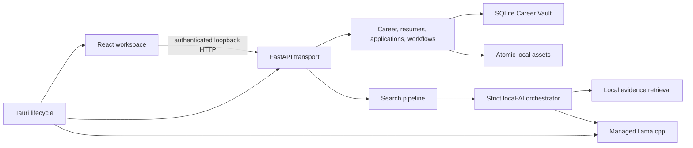

# Architecture

CareerOS Local is a Tauri 2 desktop application with a React UI, a bundled FastAPI sidecar, SQLite, content-addressed local assets, and an optional managed llama.cpp runtime.

## Native boundary

Rust allocates an ephemeral IPv4 loopback port, generates a desktop session secret, starts the bundled backend without a visible terminal, waits for readiness, supervises failure, and terminates the child on exit. Tauri capabilities permit only required core, native dialog, scoped file read/write, and safe URL-opening commands.

## Domain and persistence

The Career Vault is the canonical user-owned record. Typed profile facts carry verification state and provenance. Resume drafts reference selected facts; publishing creates immutable versions and content-addressed PDF/DOCX artifacts. Applications, events, workflows, conversations, and AI audit records reference the owning local user.

SQLite connections enforce foreign keys, WAL mode, and a busy timeout. Alembic owns schema changes. Files are always resolved beneath the configured data root and written with flush, fsync, and atomic replacement.

## Local AI

Inference follows a narrow pipeline:

1. select confirmed facts and allowed job evidence;
2. rank compact context deterministically;
3. isolate untrusted text as serialized evidence;
4. request a versioned JSON schema with deterministic sampling;
5. validate row counts, identifiers, citations, ranges, and semantics;
6. perform at most one repair attempt;
7. persist redacted execution metadata and fingerprints.

The public desktop path uses a checksum-pinned model catalog and managed llama.cpp. Ollama remains an optional local development adapter with the same structured contract.

## Search

`backend/search` separates acquisition, provider-neutral normalization, structured filters, matching, deduplication/persistence, and finalization. Normalization is the sole gate before expensive matching. Legacy service imports are module aliases only and contain no orchestration logic.

## Backup and erasure

Archive format v2 includes profile data, goals, resume data and assets, applications, workflows, coaching, and per-user AI audit rows. Version 1 remains readable. Restore requires an empty vault and runs preflight, file writes, and database insertion under an exclusive desktop vault lock with rollback. Explicit device erasure removes user records and app-owned model/runtime/staging paths without traversing unrelated directories.
