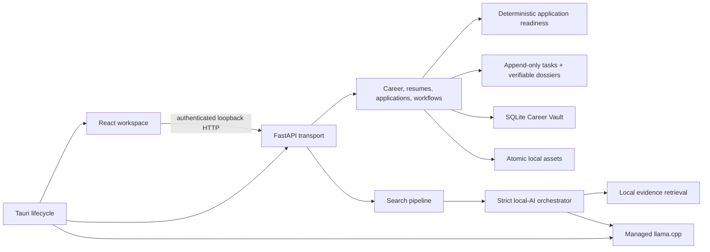

# Architecture

CareerOS Local is a Tauri 2 desktop application with a React UI, a bundled FastAPI sidecar, SQLite, content-addressed local assets, and an optional managed llama.cpp runtime.

## Native boundary

Rust allocates an ephemeral IPv4 loopback port, generates a desktop session secret, starts the bundled backend without a visible terminal, waits for readiness, supervises failure, and terminates the child on exit. Tauri capabilities permit only required core, native dialog, scoped file read/write, and safe URL-opening commands.

## Domain and persistence

The Career Vault is the canonical user-owned record. Typed profile facts carry verification state and provenance. Resume drafts reference selected facts; publishing creates immutable versions and content-addressed PDF/DOCX artifacts. Applications, events, workflows, conversations, and AI audit records reference the owning local user.

SQLite connections enforce foreign keys, secure deletion, WAL mode, and a busy timeout. Alembic owns schema changes. Files are always resolved beneath the configured data root and written with flush, fsync, and atomic replacement.

## Application readiness

`backend/applications/readiness.py` derives a preflight completeness index from one user-owned
application, the local Career Vault profile and an owned immutable resume version. Nine stable,
weighted checks report their state, evidence and corrective action. The index is explicitly not a
hiring probability or a judgment of candidate quality.

The application-pack editor updates only the captured role title, company, description,
application URL or email, and owned resume link. A conditional write on `expected_revision`
rejects stale sessions, then appends a timeline event containing only sorted field names.
User-entered values never enter that audit payload.
`readiness_export.py` emits canonical JSON and escaped Markdown; unchanged state yields unchanged
bytes, and the download header hashes the exact response body.

Artifact availability is established from the file, not its database row. Each recorded PDF or
DOCX path must remain inside the vault data root, be readable, match its immutable SHA-256 digest
and have the declared byte length. Any failed recorded format blocks the pack and exposes only the
affected format name, never a storage path or digest.

Application Detail uses a body portal and labelled modal semantics. Its dynamic focus trap includes
controls added by the preparation editor, Escape closes it, the background is inert and scroll
locked, and focus returns to the card that opened it. Detail reads use abortable latest-request-wins
loading; application updates refresh the board without tearing down the open modal. The workflow
starts no model and calls no external service; the desktop UI reaches it only through the existing
authenticated loopback API.

Next actions are stored as complete snapshots in immutable application events. Creating,
rescheduling, completing, reopening or cancelling an action appends a typed event; no task event is
edited in place. Narrow application columns project the current next action, role card fields and
latest event timestamp. The board selects only those scalar columns in one deterministic query; it
does not load `job_snapshot`, the event relationship or dossier payloads. Calendar export derives pending dated tasks from the
event stream and includes local `VALARM` reminders.

An application dossier is also an immutable typed event. Publishing validates the linked resume,
confirms every requirement-to-evidence reference against the exact resume version and records each
fact snapshot once in a content-addressed evidence catalog. Requirement rows reference fact IDs
rather than duplicating snapshots. The publisher enforces aggregate link, event and archive limits before it records the
cover letter, application answers and checklist as a new version. Downloads reconstruct a
byte-stable local ZIP containing the verified resume artifacts and canonical JSON documents. The
canonical manifest hashes every entry; both the manifest and response body expose SHA-256 headers.
Readiness remains a preflight completeness measure and is never presented as a hiring prediction.

## Local AI

Inference follows a narrow pipeline:

1. select confirmed facts and allowed job evidence;
2. rank compact context deterministically;
3. isolate untrusted text as serialized evidence;
4. request a versioned JSON schema with deterministic sampling;
5. validate row counts, identifiers, citations, ranges, and semantics;
6. perform at most one repair attempt;
7. persist redacted execution metadata and fingerprints.

The public desktop path uses a checksum-pinned model catalog and managed llama.cpp. Ollama remains an optional local development adapter with the same structured contract.

## Search

`backend/search` separates acquisition, provider-neutral normalization, structured filters, matching, deduplication/persistence, and finalization. Normalization is the sole gate before expensive matching. The provider planner builds bounded occupation and keyword queries only from the user-entered role description, search strategy and explicit preferences; it never calls a model. Its v3 cache requires `deterministic-explicit` provenance and an exact explicit-input fingerprint, so legacy or model-derived cache entries are ignored and replaced. CV prose and model-normalized fields remain local matching inputs and cannot become provider queries. A limit of zero is an explicit disable signal; only `NULL` selects a default. Legacy service imports are module aliases only and contain no orchestration logic.

Manual imports are private captures, not provider catalog records. Their platform identifier is a
stable server-side fingerprint of the authenticated user namespace and listing identity; supplied
manual ids are discarded and same-user retries return the existing relationship. This behavior was
added with the still-unreleased importer, so there are no released legacy manual rows to rewrite and
no historical data migration is required.

## Backup and erasure

Archive format v3 adds search profiles, user-scoped job matches, referenced public listings, learned preference signals, and application-to-job relationships to the profile, goal, resume, application, workflow, coaching, and AI-audit data already covered by earlier versions. Versions 1 and 2 remain readable. Historical v1, v2 and projection-free v3 application rows rebuild title, company, location, latest-event and next-action projections from their immutable snapshots and event streams after restore. Current v3 rows must provide the complete projection extension and match that canonical replay; partial or inconsistent projections are rejected transactionally. Keeping the optional row extension in v3 preserves archive compatibility without changing the manifest or table contract. Export runs against one database snapshot and excludes in-flight search state and user-specific query data from shared listing records.

Restore requires an empty vault, rejects ambiguous shared-listing or preference collisions, neutralizes runtime search state, and runs preflight, file writes, and database insertion under an exclusive desktop vault lock with rollback. Explicit erasure deletes every user-scoped vault domain, checkpoints and vacuums SQLite, and removes user-namespaced staging paths. Post-commit cleanup failures remain discoverable and retryable without traversing unrelated directories.
