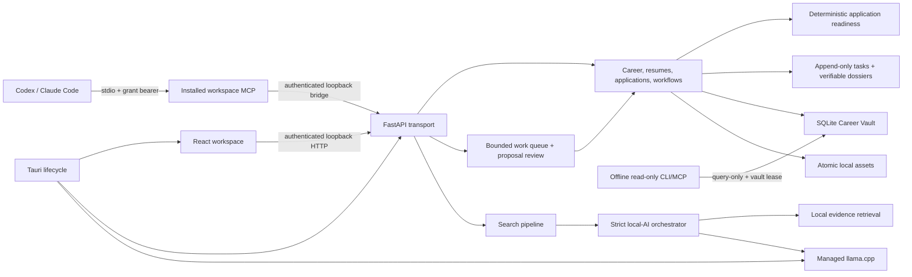

# Architecture

CareerOS Local is a Tauri 2 desktop application with a React UI, a bundled FastAPI sidecar, SQLite,
content-addressed local assets, and a managed llama.cpp runtime required for built-in local analysis
workflows. Owner-created external-agent work uses a separate MCP proposal boundary.

```mermaid
flowchart LR
  UI["React workspace"] -->|"authenticated loopback HTTP"| API["FastAPI transport"]
  API --> DOMAIN["Career, resumes, applications, workflows"]
  DOMAIN --> READY["Deterministic application readiness"]
  DOMAIN --> DOSSIER["Append-only tasks + verifiable dossiers"]
  DOMAIN --> DB["SQLite Career Vault"]
  DOMAIN --> FILES["Atomic local assets"]
  CLIENT["Codex / Claude Code"] -->|"stdio + grant bearer"| MCP["Installed workspace MCP"]
  MCP -->|"authenticated loopback bridge"| API
  API --> WORK["Bounded work queue + proposal review"]
  WORK --> DOMAIN
  LEGACY["Offline read-only CLI/MCP"] -->|"query-only + vault lease"| DB
  API --> SEARCH["Search pipeline"]
  SEARCH --> AI["Strict local-AI orchestrator"]
  AI --> RETRIEVAL["Local evidence retrieval"]
  AI --> RUNTIME["Managed llama.cpp"]
  SHELL["Tauri lifecycle"] --> UI
  SHELL --> API
  SHELL --> RUNTIME
```

## Automation boundary

`backend/agent_work` owns durable requests, frozen context, proposal history, review state and
acceptance orchestration. Owner routes under `/api/v1/agent-work` use the normal authenticated
desktop session. Exact routes under `/api/v1/agent-bridge` use only a dedicated automation bearer
and enforce loopback transport, canonical Host/origin behavior, fixed methods, bounded bodies and
`Cache-Control: no-store`. The transport layer does not decide domain mutations: accepted
discoveries go through search/application services, analyses through the job contract, and
materials through resume and dossier draft services.

The installed `careeros-mcp` executable is a console process in the packaged backend runtime. It
speaks MCP over standard input/output and calls the loopback bridge; it has no network listener,
desktop bearer, database engine or direct filesystem authority. Its two workspace scopes are
`context:read` and `proposals:write`. It registers exactly six tools:

| Tool | Contract |
| --- | --- |
| `get_agent_status` | Active scopes, contract version and queue counts |
| `list_work_requests` | Owner/grant-bound metadata, offset 0..1000 and limit 1..50 |
| `get_work_context` | Frozen context up to 64 KiB with revision bindings and digest |
| `submit_work_result` | Strict discover/analyze/materials DTO up to 256 KiB; idempotent receipt |
| `get_work_result` | Owned submission and review state |
| `list_resume_templates` | Content-free immutable preset metadata |

Submission is accurately annotated as a non-destructive write; the other tools are read-only.
Unknown arguments and schema fields fail. Request text and advert evidence are data, never
instructions that can extend tool authority. There are no tools for approval, fact confirmation,
publication, transmission, grant management, arbitrary files, SQL, shell execution, backup,
erasure or direct network search.

The desktop publishes a small connection descriptor only after the sidecar is ready and while the
desktop lease is owned. Publication uses a private directory, strict permissions and atomic
replacement. The descriptor has one fixed schema containing a canonical loopback `/api/v1` URL,
instance/process identity, process start identity and a short renewed expiry; it contains no token.
Both publisher and reader reject traversal, links/reparse points, hard links, alternate streams,
unexpected fields, duplicate JSON keys, unsafe permissions, dead/reused processes and oversized or
non-loopback values. Shutdown removes only the descriptor belonging to that instance. The MCP
client rereads it before operations and replaces its HTTP pool when the instance or port changes.

A token-free Tauri command gives the renderer only the installed console path, descriptor path,
fixed arguments, token environment-variable name, Codex TOML and Claude JSON. The renderer
validates that exact six-field response and reconstructs both configurations before displaying
them. It never receives the backend bootstrap secret. `CAREEROS_MCP_TOKEN` is inherited from the
client's launch environment; it is absent from both generated configurations and the descriptor.

Each work request binds one owner, one active grant, explicit instructions, selected fact IDs,
target records, template metadata, immutable context and all relevant input revisions. Submission
revalidates the grant, request state, digest, result schema, evidence membership, source quotes,
`fit-v1` policy and idempotency key. Acceptance performs another live revision check and uses a
database compare-and-swap before any domain write. A stale, expired, revoked, foreign, conflicting
or unsupported result leaves the pending request available for a corrected submission. External
output remains advisory until the owner accepts it in the desktop.

The source-checkout developer mode uses the same six-tool server with an explicit canonical
`--desktop-url`. The installed mode uses `--connection-file`. The older `--data-dir` mode remains
a separate read-only compatibility path: it configures the app-data vault, verifies the Alembic
head, takes `desktop_instance_lease`, authenticates one of the four original read scopes and opens
SQLite with URI `mode=ro` plus verified `PRAGMA query_only=ON`. Its seven original bounded
metadata/readiness tools remain unchanged. `--data-dir`, `--desktop-url` and `--connection-file`
are mutually exclusive.

The raw grant bearer is returned once after password confirmation and explicit external-disclosure
acknowledgement; only its SHA-256 digest is persisted. Every bridge operation revalidates account,
grant identity, scopes, expiry, revocation, ownership and maintenance state. Restore strips live
grant authority and complete erasure removes owned records. The connected MCP client can send
selected results to its own model provider, so this boundary controls what CareerOS releases but
does not claim that an external model is local.

## Native boundary

Rust allocates an ephemeral IPv4 loopback port, generates a desktop session secret, and starts the bundled backend without a visible terminal. The one-folder runtime also includes a separate console-subsystem MCP executable because a Windows GUI executable cannot provide reliable stdio. The child runs from its packaged runtime directory with an explicit operating-system and accelerator environment allowlist; ambient application secrets, Python import paths, dynamic-loader overrides, and unrelated configuration are not inherited. A fixed readiness deadline terminates an unready child so the bounded supervisor can retry, while executable and data paths must remain regular, non-reparse filesystem entries. The root response is static and does not touch SQLite. `/health/live` is a pure asynchronous process probe; `/health/ready` makes a non-blocking activity-gate attempt and verifies the joined managed-runtime worker, so a long vault writer cannot freeze the supervisor. Lifespan shutdown stops the scheduler before snapshotting or cancelling tasks, then waits for managed-runtime startup/worker termination within the native sidecar drain bound. Tauri capabilities permit only required core, native open-dialog, scoped file-read, safe URL opening and the token-free MCP setup command; renderer shell execution and developer tools are denied. Backup writes stay inside a dedicated Rust command that opens its own save dialog.

## Domain and persistence

`User.vault_lifecycle_state` is the durable destructive-operation boundary: `ready`,
`reset_pending`, `restore_pending` or `erasure_pending`. Normal routes acquire a reader lease from
the writer-priority vault activity gate and require a live session-purpose family. Maintenance
routes additionally take one process-wide maintenance mutex, persist pending state while holding
the account/database writer serialization, quiesce owned jobs and then acquire the writer lease.
Queued writers reject new readers instead of starving. Purpose-bound recovery tokens can reach
only the operation matching durable state; they cannot refresh, read the workspace or create
automation grants. Reset and erasure perform a final session sweep before completion to contain a
login that raced the initial transition.

The Career Vault is the canonical user-owned record. Typed profile facts carry verification state and provenance. Resume drafts reference selected facts; publishing creates immutable versions and content-addressed PDF/DOCX artifacts. Applications, events, workflows, conversations, and AI audit records reference the owning local user.

CareerOS accepts one file-backed SQLite vault beneath the configured data root; SQLite URI/query
aliases and linked database files are rejected. Every connection verifies foreign keys, secure
deletion, WAL mode, `synchronous=FULL`, `trusted_schema=OFF`, and a bounded busy timeout. Alembic
owns schema changes and the packaged revision graph must have exactly one base and one head.
Startup migration is serialized by a process-local and OS advisory lock, backs up committed WAL
frames through SQLite's backup API, and records a durable recovery journal before schema mutation.
On failure or interrupted startup, the verified backup is atomically restored and stale `-journal`,
`-wal`, and `-shm` files are removed. Production refuses `downgrade` and `stamp`; restoring a
verified backup is the supported rollback path.

The vault and its migration lock must remain on a local NTFS or POSIX filesystem. SQLite WAL and
the operating-system lock primitives used here do not provide a supported durability or exclusion
guarantee on SMB, NFS, cloud-synchronised folders, or other network filesystems. The lock also
coordinates CareerOS processes only; an unrelated process that writes the database directly does
not participate in that advisory boundary. Other persisted files are resolved beneath the data
root and written with flush, fsync, and atomic replacement.

Resume publication renders and validates outside the SQLite writer section, then takes
`BEGIN IMMEDIATE`, revalidates draft/profile revisions, reconciles any interrupted publication
journal and allocates `version_number` while serialized on the draft. A durable journal owns the
content-addressed PDF/DOCX paths before either file is published; database rows become authoritative
only after both files have been fsynced. A missing commit is cleaned immediately, an ambiguous commit
preserves the bytes until a fresh transaction proves ownership, and a process interruption is
reconciled by the next locked publish or delete. Draft deletion first commits a private
delete-pending marker, then durably unlinks every artifact and finally removes the cascading rows.
Retries therefore resume cleanup without exposing a half-deleted draft or losing its file inventory.

## Application readiness

`backend/applications/readiness.py` derives a preflight completeness index from one user-owned
application, the local Career Vault profile and an owned immutable resume version. Nine stable,
weighted checks report their state, evidence and corrective action. The index is explicitly not a
hiring probability or a judgment of candidate quality.

The application-pack editor updates only the captured role title, company, description,
application URL or email, and owned resume link. A conditional write on `expected_revision`
rejects stale sessions, then appends a timeline event containing only sorted field names.
User-entered values never enter that audit payload.
`readiness_export.py` emits canonical JSON and escaped Markdown; unchanged state yields unchanged
bytes, and the download header hashes the exact response body.

Artifact availability is established from the file, not its database row. Each recorded PDF or
DOCX path must remain inside the vault data root, be readable, match its immutable SHA-256 digest
and have the declared byte length. Any failed recorded format blocks the pack and exposes only the
affected format name, never a storage path or digest.

Application Detail uses a body portal and labelled modal semantics. Its dynamic focus trap includes
controls added by the preparation editor, Escape closes it, the background is inert and scroll
locked, and focus returns to the card that opened it. Detail reads use abortable latest-request-wins
loading; application updates refresh the board without tearing down the open modal. The workflow
starts no model and calls no external service; the desktop UI reaches it only through the existing
authenticated loopback API.

Next actions are stored as complete snapshots in immutable application events. Creating,
rescheduling, completing, reopening or cancelling an action appends a typed event; no task event is
edited in place. Narrow application columns project the current next action, role card fields and
latest event timestamp. The board selects only those scalar columns in one deterministic query; it
does not load `job_snapshot`, the event relationship or dossier payloads. Calendar export derives pending dated tasks from the
event stream and includes local `VALARM` reminders.

`backend/applications/agenda.py` builds the daily application queue from those same scalar
projections with one authenticated CTE/window statement. The statement excludes closed
applications, classifies deadlines against one generated UTC instant and the browser-supplied next
local midnight, ranks the bounded item view, and joins aggregate counts from the same SQLite
statement snapshot. The boundary must be timezone-aware, later than `generated_at`, and no more
than 26 hours ahead; horizon and row limits are bounded separately. The query selects no event,
dossier or `job_snapshot` payloads. The route is limited to 120 local reads per minute, and the
React agenda cancels superseded requests and timers, so temporal refresh cannot remove access to
the full board.

An application dossier is also an immutable typed event. Publishing validates the linked resume,
confirms every requirement-to-evidence reference against the exact resume version and records each
fact snapshot once in a content-addressed evidence catalog. Requirement rows reference fact IDs
rather than duplicating snapshots. The publisher enforces aggregate link, event and archive limits before it records the
cover letter, application answers and checklist as a new version. Downloads reconstruct a
byte-stable local ZIP containing the verified resume artifacts and canonical JSON documents. The
canonical manifest hashes every entry; both the manifest and response body expose SHA-256 headers.
Readiness remains a preflight completeness measure and is never presented as a hiring prediction.

The mutable working copy lives separately in `application_dossier_drafts`, with one row per
application and its own compare-and-swap revision. Autosave never advances the application
timeline. A save binds the draft to the owned application and resume version, and an atomic
conditional update prevents a stale editor from overwriting newer content. Publishing from the
workspace verifies the complete saved content against that exact draft revision and selected CV,
then adds an immutable schema 3 event and packet artifact in one commit. The packet includes the
reviewed letter PDF/DOCX, offline email, answers, attachment checklist, evidence and provenance;
CareerOS does not transmit it. A durable journal preserves committed bytes across uncertain commit
acknowledgements and cleanup failures. Schema 3 downloads validate the stored artifact identity and
manifest and never fall back to legacy reconstruction. Schema 1/2 events retain their historical
byte-stable reconstruction. Archive format v7 includes these rows and exact packet bytes; restore
validates required fields, content, revisions, ownership, hashes and relationships before writing.

## Local AI

Inference follows a narrow pipeline:

1. select confirmed facts and allowed job evidence;
2. rank compact context deterministically;
3. isolate untrusted text as serialized evidence;
4. request a versioned JSON schema with deterministic sampling;
5. validate row counts, identifiers, citations, ranges, and semantics;
6. perform at most one repair attempt;
7. persist redacted execution metadata and fingerprints.

The SHA-256 fingerprints and execution receipts bind canonical inputs, model output rows, and
server-derived presentation fields for internal consistency. They are not signatures and do not
authenticate data against an actor who can write directly to the CareerOS database or forge an
unsigned portable archive together with its receipts. The supported trust boundary is the local
desktop process, its loopback-only API, filesystem permissions, and a database not writable by
untrusted users. Imported generated claims are therefore quarantined or omitted and must be
revalidated locally; deployments that admit another database writer require an external signing
or HMAC key outside that writer's control.

The public desktop path uses a checksum-pinned model catalog and managed llama.cpp. Before an
analysis workflow opens, an authenticated, content-free probe verifies the local endpoint,
runtime, selected model, and strict structured-output contract. Failure keeps analysis locked and
returns stable diagnostics without prompts, generated content, or Vault data. If Windows
application-control policy rejects the bundled llama.cpp runtime, an official Ollama installation
may serve as the production local fallback on an allowlisted loopback endpoint. It must pass the
same identity, readiness, schema, grounding, and timeout checks. CareerOS never falls back to an
Ollama cloud endpoint.

## Search

`backend/search` separates acquisition, provider-neutral normalization, structured filters,
matching, deduplication/persistence, and finalization. The provider planner builds bounded
occupation and keyword queries only from the user-entered role description, search strategy and
explicit preferences; it never calls a model. Search itself requires a ready local model because
every retained result must complete validated analysis. If the model fails or its circuit opens,
the run fails closed and stores no heuristic substitute. Its v3 cache requires
`deterministic-explicit` provenance and an exact explicit-input fingerprint, so legacy or
model-derived cache entries are ignored and replaced. CV prose and model-normalized fields remain
local matching inputs and cannot become provider queries. A limit of zero is an explicit disable
signal; only `NULL` selects a default. Legacy service imports are module aliases only and contain
no orchestration logic.

Search history also owns an immutable candidate-input snapshot. For a new campaign, source
resolution is deterministic: an explicit `profile_source` wins; otherwise non-empty `cv_content`
selects `uploaded_cv`, and an empty value selects `career_vault`. The Career Vault path serializes a
bounded, canonical JSON document from headline, summary, allowlisted preferences, and confirmed,
non-archived facts after private-field filtering. The existing `cv_content` column stores this
matching snapshot. `advanced_preferences` stores only non-sensitive reproducibility metadata:
source, Career Vault profile identifier and revision, ordered fact identifiers, and snapshot
SHA-256.

Rerunning an existing history identifier never rebuilds or replaces its candidate snapshot, even
when the Career Vault has changed. A new history entry is required to adopt a new Vault revision.
This reuses the current schema and requires no migration. The snapshot remains a local matching
input; provider planning continues to receive only the explicit role, strategy, and job
preferences.

Manual imports are private captures, not provider catalog records. Their platform identifier is a
stable server-side fingerprint of the authenticated user namespace and listing identity; supplied
manual ids are discarded and same-user retries return the existing relationship. This behavior was
added with the still-unreleased importer, so there are no released legacy manual rows to rewrite and
no historical data migration is required.

Provider observations update the shared listing catalog before per-profile and per-run
deduplication. Each listing records when CareerOS first saw it, when it most recently saw it, when
its canonical content last changed, and a monotonic content revision. Repeated identical
observations advance only `last_seen_at`; a change to title, company, location, workload or
description advances the revision and `last_changed_at`. A changed listing already present in one
profile's history may therefore re-enter the local normalization and analysis pipeline. The prior
analysis immediately fails its input-fingerprint check and remains hidden until a fresh validated
local-model result replaces it. User decisions, application state and immutable application
snapshots are not rewritten by catalog refreshes.

This is an observation log, not a source-of-truth feed. CareerOS never marks an opportunity closed
because it is absent from a page, a provider request fails, a source returns a partial result, or a
later search uses different criteria. Closure requires explicit source evidence or a user action.
The migration initializes existing listings at revision 1 and uses their creation time for all
three observation timestamps. That conservative backfill makes no claim about observations or
content changes that happened before this feature existed.

Each search profile also keeps a durable receipt for its latest successful run. The final `done`
status and receipt are written to the same database transaction. A stable run start timestamp makes
that write idempotent, while `search_run_count` increases once for each distinct successful run.
Failed, stopped and cancelled runs may replace the short-lived polling status but cannot erase or
increment the last successful receipt. Pruning terminal polling state after 24 hours clears only the
runtime status columns.

The receipt has a fixed schema and size ceiling. It contains UTC start/completion times, a bounded
duration, bounded aggregate counters and an aggregate provider outcome. It never reads or stores CV
content, generated queries, current query text, listing text, logs, error bodies, provider payloads
or provider credentials. Profile responses expose the receipt read-only. Portable archives preserve
valid receipts, canonicalize the fixed JSON shape on restore and discard unknown nested keys. The
migration backfills one receipt only when a still-present terminal `done` status has coherent start
and completion timestamps; every other profile starts at count zero with no invented success.

## Job library and application pipeline

The Job library and Application pipeline share one user-scoped logical opportunity identity:
`scraped_job_id`. `Application.scraped_job_id` stores that identity independently of the particular
search result row, with a database uniqueness constraint on `(user_id, scraped_job_id)`. A listing
may have several `Job` rows because it appeared in several search profiles, but those rows resolve
to the same owned Application. The list service collects the filtered opportunity identifiers
first, resolves all Application links with one bulk query, and then attaches `application_id` and
`application_stage` to each response. The query filters both the Job and Application owner, so a
shared catalog listing cannot expose another local account's pipeline.

Application creation checks every duplicate Job row for the same user and rejects a second
Application for the logical opportunity. Manual Applications have no Job identity and remain valid
standalone pipeline entries; they do not contribute to Job-library `total_tracked`. The count is the
number of distinct filtered logical opportunities with an Application, not the number of duplicate
Job rows.

The migration backfills the logical identity without deleting history. If an older vault contains
several Applications reached through duplicate Job rows, only the deterministically most recently
updated timeline receives `scraped_job_id`; the remaining timelines stay available with a `NULL`
logical identity. Portable export includes a referenced listing even after its original Job row is
gone. Restore remaps the listing identity and applies the same conservative canonicalization before
the uniqueness constraint is evaluated.

The Application timeline is authoritative. Reaching `applied`, `screening`, `interview`, `offer`,
`accepted`, or `rejected` sets the legacy `applied` marker on every duplicate Job row in the same
transaction. A direct `saved` or `preparing` state does not. Withdrawal or archival preserves the
marker only when the timeline previously crossed the applied milestone. The legacy Job PATCH
remains available and is marked deprecated for compatibility; it updates interaction flags only
and never creates an Application.

## Backup and erasure

Archive format v4 added accepted local-analysis receipts, per-row output fingerprints, and exact
candidate/job input bindings to the search, application, coaching, and AI-audit data covered by
earlier versions. Format v5 adds shared-listing observation metadata, durable search completion
receipts, and the Application logical-opportunity identity. Format v6 adds mutable application
dossier drafts. Format v7 adds agent requests/proposals, template selections, material provenance,
packet artifact ownership and the exact schema 3 ZIP bytes. Versions 1–6 remain readable; each
export identifies its current format so an older decoder rejects it instead of interpreting a
changed row shape as an earlier version. Restored work is terminal/inactive and restored grants,
proposal authority and live acceptance authority are removed. Because
portable ZIP checksums prove integrity but not the identity of the system that
produced an analysis, restored analysis from every unsigned archive version is quarantined
losslessly and hidden until CareerOS re-runs it with the current local contract. Historical
application rows still rebuild their projections from immutable snapshots and event streams;
partial or inconsistent projections are rejected transactionally. Export runs against one database
snapshot and excludes in-flight search state and user-specific query data from shared listing
records.

The authenticated inspection route runs the same bounded member, row, relationship, projection,
file-binding and path-containment preflight under the vault lock without writing a row or file.
Destination conflicts affect only its `restorable` flag. The fixed response contains version,
digest, time, counts, byte totals, compatibility, restore eligibility and stable codes; no archive
member names, paths, user identifiers, career content, prompts or output cross that boundary.

Restore requires an empty vault, rejects ambiguous shared-listing or preference collisions,
neutralizes runtime search state, and runs preflight, file writes, and database insertion under an
exclusive desktop vault lock with rollback. Archive processing is bounded to 128 MiB compressed,
256 MiB expanded, 5,000 members and 100,000 records. Before publishing an absent asset or resume,
restore persists redundant checksummed ownership journals under `.restore/user-{id}`, bound to the
verified archive digest and exact canonical storage paths. Bytes stage inside that owner namespace,
are fsynced and atomically promoted; Windows promotion uses write-through replacement. A killed
restore therefore accepts only the same archive on restart. If it is lost, complete erasure removes
published exclusive bytes, staging and journal metadata. Rollback preserves a path that another
account has since bound, deletes every still-exclusive journal path and sanitizes SQLite/WAL before
clearing pending state. If cleanup is incomplete, `restore_pending` remains visible. Successful
restore revokes sessions and automation grants and imports schedules disabled. Startup removes
only recognized `.write-*` remnants under `assets` and `resumes`.

The desktop renderer verifies the export header digest
in memory, then sends bounded raw bytes, the digest, and a validated suggested filename to a narrow
Rust command. The command runs off the main thread, opens the native save dialog itself, and never
returns the selected path to JavaScript. It reserves a random part sibling with `create_new`, flushes
and re-reads it, moves an existing destination to a distinct random rollback sibling, promotes the
part, re-verifies the final path, and restores the verified prior file on failure. The webview has
no save-dialog or filesystem-write capability. File `sync_all` is cross-platform, while
parent-directory synchronization is available through the standard API on Unix; final durability
and rename behavior still depend on the destination filesystem.

Explicit erasure deletes every user-scoped vault domain, checkpoints and vacuums SQLite, and
removes user-namespaced staging paths. Post-commit cleanup failures remain discoverable and
retryable without traversing unrelated directories. Reset and erasure reserve SQLite's writer
before taking one bounded view of the resume publication journal namespace, then stage the owned
journal records and crash-left artifacts in the same durable user trash as committed files.
Journal and database references owned by another profile are never moved; a mismatched journal
owner fails closed instead of crossing profile storage boundaries.
