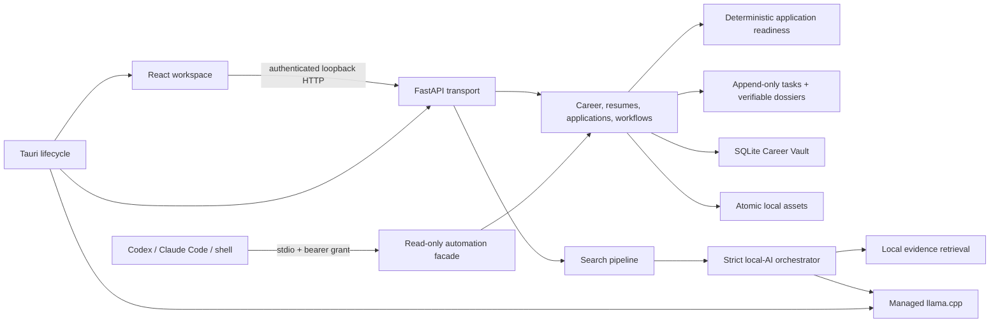

# Architecture

CareerOS Local is a Tauri 2 desktop application with a React UI, a bundled FastAPI sidecar, SQLite,
content-addressed local assets, and a managed llama.cpp runtime required for analysis workflows.

```mermaid
flowchart LR
  UI["React workspace"] -->|"authenticated loopback HTTP"| API["FastAPI transport"]
  API --> DOMAIN["Career, resumes, applications, workflows"]
  DOMAIN --> READY["Deterministic application readiness"]
  DOMAIN --> DOSSIER["Append-only tasks + verifiable dossiers"]
  DOMAIN --> DB["SQLite Career Vault"]
  DOMAIN --> FILES["Atomic local assets"]
  CLIENT["Codex / Claude Code / shell"] -->|"stdio + bearer grant"| AUTOMATION["Read-only automation facade"]
  AUTOMATION --> DOMAIN
  API --> SEARCH["Search pipeline"]
  SEARCH --> AI["Strict local-AI orchestrator"]
  AI --> RETRIEVAL["Local evidence retrieval"]
  AI --> RUNTIME["Managed llama.cpp"]
  SHELL["Tauri lifecycle"] --> UI
  SHELL --> API
  SHELL --> RUNTIME
```

## Automation boundary

`backend/automation` provides one least-privilege facade for both the `careeros` CLI and the MCP
server. It does not call the loopback HTTP API or reuse the desktop session token. Instead, the
process configures the existing vault from the operating-system application-data directory,
verifies the Alembic head, acquires `desktop_instance_lease`, authenticates a bearer grant and
opens a fresh SQLAlchemy session for each read.

Only `authorize` may migrate an older vault, and it does so while the desktop app is closed.
Ordinary CLI reads and MCP startup fail with `migration_required` rather than changing the schema.
A CLI command holds the lease for its operation. MCP acquires it for bootstrap, releases it while
idle, then reacquires it for each tool call. This keeps the established single-writer rule without
forcing the desktop to remain closed for the life of an agent session.

An automation grant belongs to exactly one CareerOS user. It stores a label, allowed scopes,
expiry and revocation time alongside a SHA-256 digest of a randomly generated bearer token. The
raw token is returned once at authorization and is never persisted. Authentication rejects
missing, malformed, unknown, expired or revoked tokens before constructing the facade. A restore
revokes existing grants; complete vault deletion removes them.

The four scopes map to a fixed tool set:

| Scope | MCP tools | Returned data |
| --- | --- | --- |
| `system:read` | `get_status`, `get_local_model_status` | Version, schema, enabled scopes/tools and content-free local-model readiness |
| `career:read` | `get_career_summary` | Profile presence, revision, completeness, issue count and fact-family counts |
| `resume:read` | `get_resume_catalog` | Bounded draft and published-version metadata |
| `applications:read` | `list_applications`, `get_application_readiness`, `get_application_agenda` | Bounded application projections, deterministic preflight checks and follow-ups |

The MCP process uses only standard input/output. It registers tools allowed by the authenticated
scope set and marks them read-only, non-destructive, idempotent and closed-world. Those annotations
help clients present the tools correctly; scope checks in the facade are the enforcement boundary.
There is no socket listener and no mutation, document export, backup/restore, erasure, arbitrary
file, SQL, free-form prompt or network-search tool.

Tool DTOs deliberately omit resume and source-document bodies, dedicated contact records, prompts,
artifact bytes, access tokens and local storage paths. User-authored labels, company names,
locations and task titles remain visible within their authorized scope and may contain sensitive
text. Lists and time windows have fixed upper bounds. The
unauthenticated `doctor` setup command is separate from the tool facade and intentionally reports
the resolved data directory so a local operator can diagnose configuration.

MCP startup requires `--acknowledge-agent-disclosure` because the connected client controls what
happens after a result leaves the process over stdio. CareerOS opens no provider connection, but
Codex, Claude Code or another client may include returned private metadata in a remote request.
Before every tool read, MCP obtains the vault lease and authenticates the bearer token again. An
expired or revoked grant fails on the next call; a grant whose identity or scopes changed requires
a new MCP session. If the desktop owns the lease, the tool returns `vault_busy`.

## Native boundary

Rust allocates an ephemeral IPv4 loopback port, generates a desktop session secret, starts the bundled backend without a visible terminal, waits for readiness, supervises failure, and terminates the child on exit. Tauri capabilities permit only required core, native open-dialog, scoped file-read, and safe URL-opening commands. Backup writes stay inside a dedicated Rust command that opens its own save dialog.

## Domain and persistence

The Career Vault is the canonical user-owned record. Typed profile facts carry verification state and provenance. Resume drafts reference selected facts; publishing creates immutable versions and content-addressed PDF/DOCX artifacts. Applications, events, workflows, conversations, and AI audit records reference the owning local user.

SQLite connections enforce foreign keys, secure deletion, WAL mode, and a busy timeout. Alembic owns schema changes. Files are always resolved beneath the configured data root and written with flush, fsync, and atomic replacement.

## Application readiness

`backend/applications/readiness.py` derives a preflight completeness index from one user-owned
application, the local Career Vault profile and an owned immutable resume version. Nine stable,
weighted checks report their state, evidence and corrective action. The index is explicitly not a
hiring probability or a judgment of candidate quality.

The application-pack editor updates only the captured role title, company, description,
application URL or email, and owned resume link. A conditional write on `expected_revision`
rejects stale sessions, then appends a timeline event containing only sorted field names.
User-entered values never enter that audit payload.
`readiness_export.py` emits canonical JSON and escaped Markdown; unchanged state yields unchanged
bytes, and the download header hashes the exact response body.

Artifact availability is established from the file, not its database row. Each recorded PDF or
DOCX path must remain inside the vault data root, be readable, match its immutable SHA-256 digest
and have the declared byte length. Any failed recorded format blocks the pack and exposes only the
affected format name, never a storage path or digest.

Application Detail uses a body portal and labelled modal semantics. Its dynamic focus trap includes
controls added by the preparation editor, Escape closes it, the background is inert and scroll
locked, and focus returns to the card that opened it. Detail reads use abortable latest-request-wins
loading; application updates refresh the board without tearing down the open modal. The workflow
starts no model and calls no external service; the desktop UI reaches it only through the existing
authenticated loopback API.

Next actions are stored as complete snapshots in immutable application events. Creating,
rescheduling, completing, reopening or cancelling an action appends a typed event; no task event is
edited in place. Narrow application columns project the current next action, role card fields and
latest event timestamp. The board selects only those scalar columns in one deterministic query; it
does not load `job_snapshot`, the event relationship or dossier payloads. Calendar export derives pending dated tasks from the
event stream and includes local `VALARM` reminders.

`backend/applications/agenda.py` builds the daily application queue from those same scalar
projections with one authenticated CTE/window statement. The statement excludes closed
applications, classifies deadlines against one generated UTC instant and the browser-supplied next
local midnight, ranks the bounded item view, and joins aggregate counts from the same SQLite
statement snapshot. The boundary must be timezone-aware, later than `generated_at`, and no more
than 26 hours ahead; horizon and row limits are bounded separately. The query selects no event,
dossier or `job_snapshot` payloads. The route is limited to 120 local reads per minute, and the
React agenda cancels superseded requests and timers, so temporal refresh cannot remove access to
the full board.

An application dossier is also an immutable typed event. Publishing validates the linked resume,
confirms every requirement-to-evidence reference against the exact resume version and records each
fact snapshot once in a content-addressed evidence catalog. Requirement rows reference fact IDs
rather than duplicating snapshots. The publisher enforces aggregate link, event and archive limits before it records the
cover letter, application answers and checklist as a new version. Downloads reconstruct a
byte-stable local ZIP containing the verified resume artifacts and canonical JSON documents. The
canonical manifest hashes every entry; both the manifest and response body expose SHA-256 headers.
Readiness remains a preflight completeness measure and is never presented as a hiring prediction.

## Local AI

Inference follows a narrow pipeline:

1. select confirmed facts and allowed job evidence;
2. rank compact context deterministically;
3. isolate untrusted text as serialized evidence;
4. request a versioned JSON schema with deterministic sampling;
5. validate row counts, identifiers, citations, ranges, and semantics;
6. perform at most one repair attempt;
7. persist redacted execution metadata and fingerprints.

The SHA-256 fingerprints and execution receipts bind canonical inputs, model output rows, and
server-derived presentation fields for internal consistency. They are not signatures and do not
authenticate data against an actor who can write directly to the CareerOS database or forge an
unsigned portable archive together with its receipts. The supported trust boundary is the local
desktop process, its loopback-only API, filesystem permissions, and a database not writable by
untrusted users. Imported generated claims are therefore quarantined or omitted and must be
revalidated locally; deployments that admit another database writer require an external signing
or HMAC key outside that writer's control.

The public desktop path uses a checksum-pinned model catalog and managed llama.cpp. Before an
analysis workflow opens, an authenticated, content-free probe verifies the local endpoint,
runtime, selected model, and strict structured-output contract. Failure keeps analysis locked and
returns stable diagnostics without prompts, generated content, or Vault data. If Windows
application-control policy rejects the bundled llama.cpp runtime, an official Ollama installation
may serve as the production local fallback on an allowlisted loopback endpoint. It must pass the
same identity, readiness, schema, grounding, and timeout checks. CareerOS never falls back to an
Ollama cloud endpoint.

## Search

`backend/search` separates acquisition, provider-neutral normalization, structured filters,
matching, deduplication/persistence, and finalization. The provider planner builds bounded
occupation and keyword queries only from the user-entered role description, search strategy and
explicit preferences; it never calls a model. Search itself requires a ready local model because
every retained result must complete validated analysis. If the model fails or its circuit opens,
the run fails closed and stores no heuristic substitute. Its v3 cache requires
`deterministic-explicit` provenance and an exact explicit-input fingerprint, so legacy or
model-derived cache entries are ignored and replaced. CV prose and model-normalized fields remain
local matching inputs and cannot become provider queries. A limit of zero is an explicit disable
signal; only `NULL` selects a default. Legacy service imports are module aliases only and contain
no orchestration logic.

Search history also owns an immutable candidate-input snapshot. For a new campaign, source
resolution is deterministic: an explicit `profile_source` wins; otherwise non-empty `cv_content`
selects `uploaded_cv`, and an empty value selects `career_vault`. The Career Vault path serializes a
bounded, canonical JSON document from headline, summary, allowlisted preferences, and confirmed,
non-archived facts after private-field filtering. The existing `cv_content` column stores this
matching snapshot. `advanced_preferences` stores only non-sensitive reproducibility metadata:
source, Career Vault profile identifier and revision, ordered fact identifiers, and snapshot
SHA-256.

Rerunning an existing history identifier never rebuilds or replaces its candidate snapshot, even
when the Career Vault has changed. A new history entry is required to adopt a new Vault revision.
This reuses the current schema and requires no migration. The snapshot remains a local matching
input; provider planning continues to receive only the explicit role, strategy, and job
preferences.

Manual imports are private captures, not provider catalog records. Their platform identifier is a
stable server-side fingerprint of the authenticated user namespace and listing identity; supplied
manual ids are discarded and same-user retries return the existing relationship. This behavior was
added with the still-unreleased importer, so there are no released legacy manual rows to rewrite and
no historical data migration is required.

Provider observations update the shared listing catalog before per-profile and per-run
deduplication. Each listing records when CareerOS first saw it, when it most recently saw it, when
its canonical content last changed, and a monotonic content revision. Repeated identical
observations advance only `last_seen_at`; a change to title, company, location, workload or
description advances the revision and `last_changed_at`. A changed listing already present in one
profile's history may therefore re-enter the local normalization and analysis pipeline. The prior
analysis immediately fails its input-fingerprint check and remains hidden until a fresh validated
local-model result replaces it. User decisions, application state and immutable application
snapshots are not rewritten by catalog refreshes.

This is an observation log, not a source-of-truth feed. CareerOS never marks an opportunity closed
because it is absent from a page, a provider request fails, a source returns a partial result, or a
later search uses different criteria. Closure requires explicit source evidence or a user action.
The migration initializes existing listings at revision 1 and uses their creation time for all
three observation timestamps. That conservative backfill makes no claim about observations or
content changes that happened before this feature existed.

Each search profile also keeps a durable receipt for its latest successful run. The final `done`
status and receipt are written to the same database transaction. A stable run start timestamp makes
that write idempotent, while `search_run_count` increases once for each distinct successful run.
Failed, stopped and cancelled runs may replace the short-lived polling status but cannot erase or
increment the last successful receipt. Pruning terminal polling state after 24 hours clears only the
runtime status columns.

The receipt has a fixed schema and size ceiling. It contains UTC start/completion times, a bounded
duration, bounded aggregate counters and an aggregate provider outcome. It never reads or stores CV
content, generated queries, current query text, listing text, logs, error bodies, provider payloads
or provider credentials. Profile responses expose the receipt read-only. Portable archives preserve
valid receipts, canonicalize the fixed JSON shape on restore and discard unknown nested keys. The
migration backfills one receipt only when a still-present terminal `done` status has coherent start
and completion timestamps; every other profile starts at count zero with no invented success.

## Job library and application pipeline

The Job library and Application pipeline share one user-scoped logical opportunity identity:
`scraped_job_id`. `Application.scraped_job_id` stores that identity independently of the particular
search result row, with a database uniqueness constraint on `(user_id, scraped_job_id)`. A listing
may have several `Job` rows because it appeared in several search profiles, but those rows resolve
to the same owned Application. The list service collects the filtered opportunity identifiers
first, resolves all Application links with one bulk query, and then attaches `application_id` and
`application_stage` to each response. The query filters both the Job and Application owner, so a
shared catalog listing cannot expose another local account's pipeline.

Application creation checks every duplicate Job row for the same user and rejects a second
Application for the logical opportunity. Manual Applications have no Job identity and remain valid
standalone pipeline entries; they do not contribute to Job-library `total_tracked`. The count is the
number of distinct filtered logical opportunities with an Application, not the number of duplicate
Job rows.

The migration backfills the logical identity without deleting history. If an older vault contains
several Applications reached through duplicate Job rows, only the deterministically most recently
updated timeline receives `scraped_job_id`; the remaining timelines stay available with a `NULL`
logical identity. Portable export includes a referenced listing even after its original Job row is
gone. Restore remaps the listing identity and applies the same conservative canonicalization before
the uniqueness constraint is evaluated.

The Application timeline is authoritative. Reaching `applied`, `screening`, `interview`, `offer`,
`accepted`, or `rejected` sets the legacy `applied` marker on every duplicate Job row in the same
transaction. A direct `saved` or `preparing` state does not. Withdrawal or archival preserves the
marker only when the timeline previously crossed the applied milestone. The legacy Job PATCH
remains available and is marked deprecated for compatibility; it updates interaction flags only
and never creates an Application.

## Backup and erasure

Archive format v4 added accepted local-analysis receipts, per-row output fingerprints, and exact
candidate/job input bindings to the search, application, coaching, and AI-audit data covered by
earlier versions. Format v5 adds shared-listing observation metadata, durable search completion
receipts, and the Application logical-opportunity identity. Versions 1–4 remain readable; a v5
export identifies itself as v5 so a v4 decoder rejects it instead of interpreting a changed row
shape as v4. Because portable ZIP checksums prove integrity but not the identity of the system that
produced an analysis, restored analysis from every unsigned archive version is quarantined
losslessly and hidden until CareerOS re-runs it with the current local contract. Historical
application rows still rebuild their projections from immutable snapshots and event streams;
partial or inconsistent projections are rejected transactionally. Export runs against one database
snapshot and excludes in-flight search state and user-specific query data from shared listing
records.

The authenticated inspection route runs the same bounded member, row, relationship, projection,
file-binding and path-containment preflight under the vault lock without writing a row or file.
Destination conflicts affect only its `restorable` flag. The fixed response contains version,
digest, time, counts, byte totals, compatibility, restore eligibility and stable codes; no archive
member names, paths, user identifiers, career content, prompts or output cross that boundary.

Restore requires an empty vault, rejects ambiguous shared-listing or preference collisions,
neutralizes runtime search state, and runs preflight, file writes, and database insertion under an
exclusive desktop vault lock with rollback. The desktop renderer verifies the export header digest
in memory, then sends bounded raw bytes, the digest, and a validated suggested filename to a narrow
Rust command. The command runs off the main thread, opens the native save dialog itself, and never
returns the selected path to JavaScript. It reserves a random part sibling with `create_new`, flushes
and re-reads it, moves an existing destination to a distinct random rollback sibling, promotes the
part, re-verifies the final path, and restores the verified prior file on failure. The webview has
no save-dialog or filesystem-write capability. File `sync_all` is cross-platform, while
parent-directory synchronization is available through the standard API on Unix; final durability
and rename behavior still depend on the destination filesystem.

Explicit erasure deletes every user-scoped vault domain, checkpoints and vacuums SQLite, and
removes user-namespaced staging paths. Post-commit cleanup failures remain discoverable and
retryable without traversing unrelated directories.
